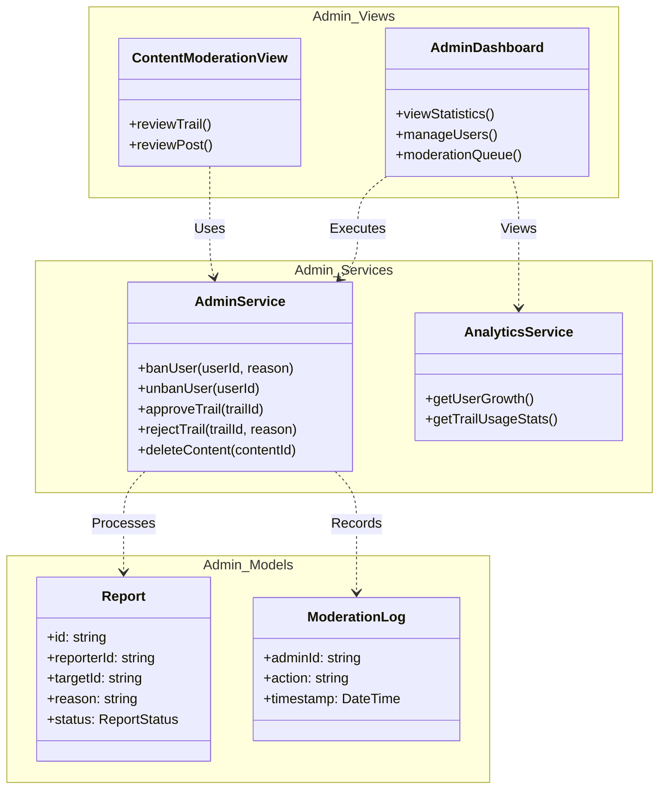

```mermaid
classDiagram
    direction TB

    namespace Admin_Views {
        class AdminDashboard {
            +viewStatistics()
            +manageUsers()
            +moderationQueue()
        }
        class ContentModerationView {
            +reviewTrail()
            +reviewPost()
        }
    }

    namespace Admin_Services {
        class AdminService {
            +banUser(userId, reason)
            +unbanUser(userId)
            +approveTrail(trailId)
            +rejectTrail(trailId, reason)
            +deleteContent(contentId)
        }
        class AnalyticsService {
            +getUserGrowth()
            +getTrailUsageStats()
        }
    }

    namespace Admin_Models {
        class Report {
            +id: string
            +reporterId: string
            +targetId: string
            +reason: string
            +status: ReportStatus
        }
        class ModerationLog {
            +adminId: string
            +action: string
            +timestamp: DateTime
        }
    }

    AdminDashboard ..> AdminService : Executes
    AdminDashboard ..> AnalyticsService : Views
    ContentModerationView ..> AdminService : Uses
    
    AdminService ..> Report : Processes
    AdminService ..> ModerationLog : Records
```
