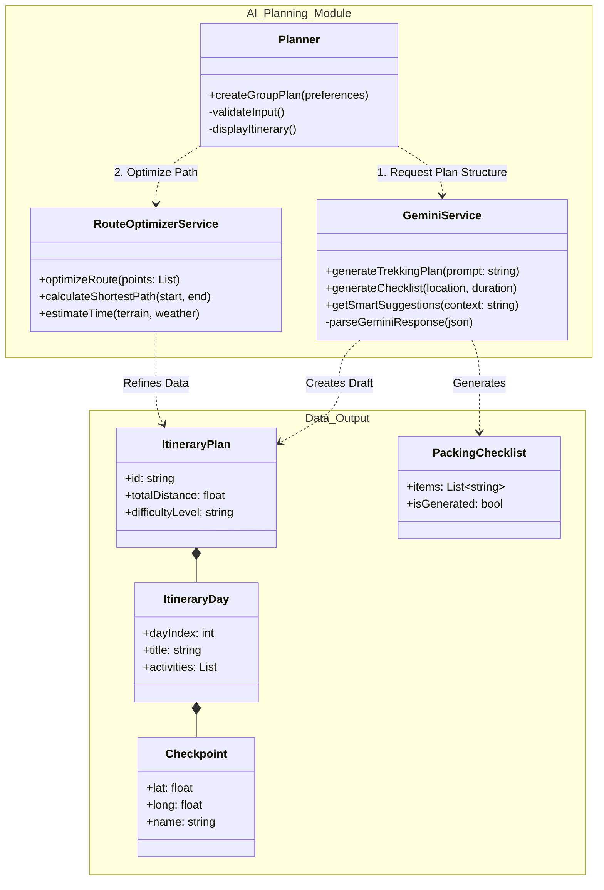

```mermaid
classDiagram
    direction TB
    
    namespace AI_Planning_Module {
        class Planner {
            +createGroupPlan(preferences)
            -validateInput()
            -displayItinerary()
        }

        class GeminiService {
            +generateTrekkingPlan(prompt: string)
            +generateChecklist(location, duration)
            +getSmartSuggestions(context: string)
            -parseGeminiResponse(json)
        }

        class RouteOptimizerService {
            +optimizeRoute(points: List)
            +calculateShortestPath(start, end)
            +estimateTime(terrain, weather)
        }
    }

    namespace Data_Output {
        class ItineraryPlan {
            +id: string
            +totalDistance: float
            +difficultyLevel: string
        }
        
        class ItineraryDay {
            +dayIndex: int
            +title: string
            +activities: List
        }
        
        class Checkpoint {
            +lat: float
            +long: float
            +name: string
        }

        class PackingChecklist {
            +items: List~string~
            +isGenerated: bool
        }
    }
    Planner ..> GeminiService : 1. Request Plan Structure
    Planner ..> RouteOptimizerService : 2. Optimize Path
    
    GeminiService ..> ItineraryPlan : Creates Draft
    GeminiService ..> PackingChecklist : Generates
    RouteOptimizerService ..> ItineraryPlan : Refines Data
    
    ItineraryPlan *-- ItineraryDay
    ItineraryDay *-- Checkpoint
```
