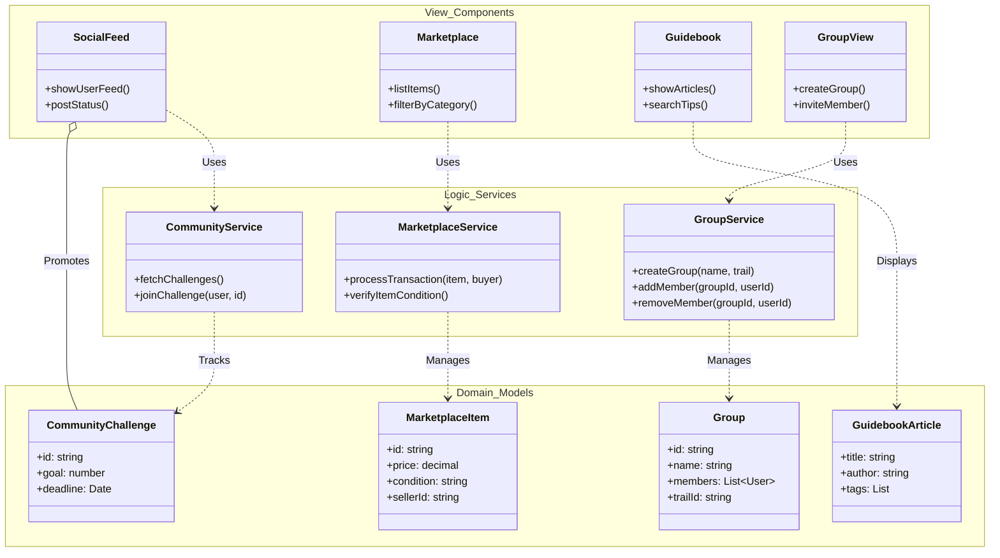

```mermaid
classDiagram
    direction TB

    namespace View_Components {
        class SocialFeed {
            +showUserFeed()
            +postStatus()
        }
        class Marketplace {
            +listItems()
            +filterByCategory()
        }
        class Guidebook {
            +showArticles()
            +searchTips()
        }
        class GroupView {
            +createGroup()
            +inviteMember()
        }
    }

    namespace Logic_Services {
        class MarketplaceService {
            +processTransaction(item, buyer)
            +verifyItemCondition()
        }
        class CommunityService {
            +fetchChallenges()
            +joinChallenge(user, id)
        }
        class GroupService {
            +createGroup(name, trail)
            +addMember(groupId, userId)
            +removeMember(groupId, userId)
        }
    }

    namespace Domain_Models {
        class MarketplaceItem {
            +id: string
            +price: decimal
            +condition: string
            +sellerId: string
        }
        class CommunityChallenge {
            +id: string
            +goal: number
            +deadline: Date
        }
        class GuidebookArticle {
            +title: string
            +author: string
            +tags: List
        }
        class Group {
            +id: string
            +name: string
            +members: List~User~
            +trailId: string
        }
    }

    %% Relationships
    %% Long link defined first to route around
    Guidebook ..> GuidebookArticle : Displays

    SocialFeed ..> CommunityService : Uses
    Marketplace ..> MarketplaceService : Uses
    GroupView ..> GroupService : Uses
    
    MarketplaceService ..> MarketplaceItem : Manages
    CommunityService ..> CommunityChallenge : Tracks
    GroupService ..> Group : Manages
    
    SocialFeed o-- CommunityChallenge : Promotes
```
