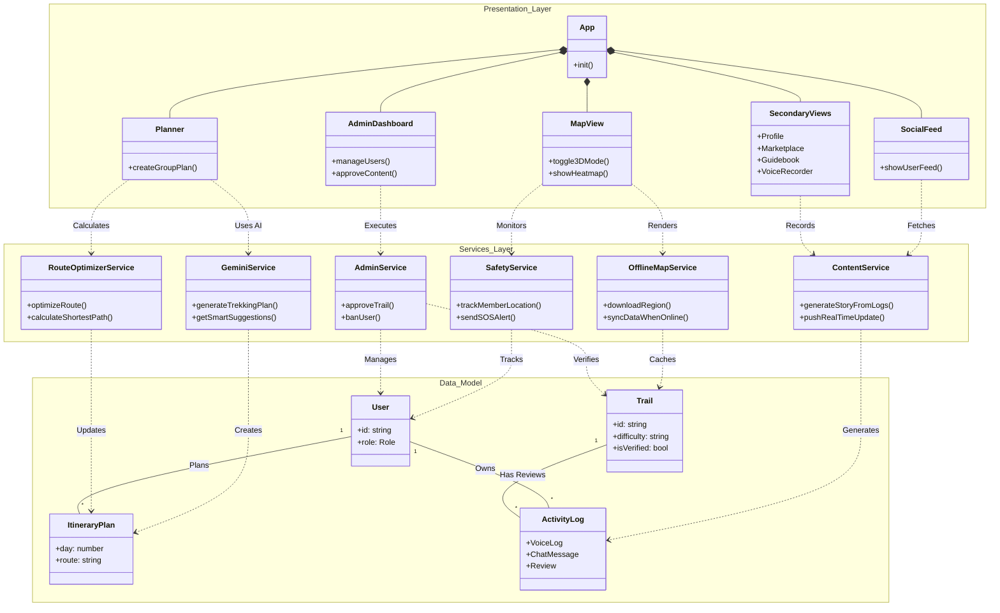

```mermaid
classDiagram
    direction TB
    namespace Presentation_Layer {
        class App {
            +init()
        }
        class Planner {
            +createGroupPlan()
        }
        class MapView {
            +toggle3DMode()
            +showHeatmap()
        }
        class SocialFeed {
            +showUserFeed()
        }
        class AdminDashboard {
            +manageUsers()
            +approveContent()
        }
        class SecondaryViews {
            +Profile
            +Marketplace
            +Guidebook
            +VoiceRecorder
        }
    }
    namespace Services_Layer {
        class GeminiService {
            +generateTrekkingPlan()
            +getSmartSuggestions()
        }
        class RouteOptimizerService {
            +optimizeRoute()
            +calculateShortestPath()
        }
        class SafetyService {
            +trackMemberLocation()
            +sendSOSAlert()
        }
        class OfflineMapService {
            +downloadRegion()
            +syncDataWhenOnline()
        }
        class ContentService {
            +generateStoryFromLogs()
            +pushRealTimeUpdate()
        }
        class AdminService {
            +approveTrail()
            +banUser()
        }
    }
    namespace Data_Model {
        class User {
            +id: string
            +role: Role
        }
        class Trail {
            +id: string
            +difficulty: string
            +isVerified: bool
        }
        class ItineraryPlan {
            +day: number
            +route: string
        }
        class ActivityLog {
            +VoiceLog
            +ChatMessage
            +Review
        }
    }
    App *-- Planner
    App *-- MapView
    App *-- SocialFeed
    App *-- AdminDashboard
    App *-- SecondaryViews
    Planner ..> GeminiService : Uses AI
    Planner ..> RouteOptimizerService : Calculates
    MapView ..> OfflineMapService : Renders
    MapView ..> SafetyService : Monitors
    SocialFeed ..> ContentService : Fetches
    SecondaryViews ..> ContentService : Records
    AdminDashboard ..> AdminService : Executes
    GeminiService ..> ItineraryPlan : Creates
    RouteOptimizerService ..> ItineraryPlan : Updates
    
    SafetyService ..> User : Tracks
    OfflineMapService ..> Trail : Caches
    
    AdminService ..> User : Manages
    AdminService ..> Trail : Verifies
    
    ContentService ..> ActivityLog : Generates
    User "1" -- "*" ActivityLog : Owns
    User "1" -- "*" ItineraryPlan : Plans
    Trail "1" -- "*" ActivityLog : Has Reviews
```