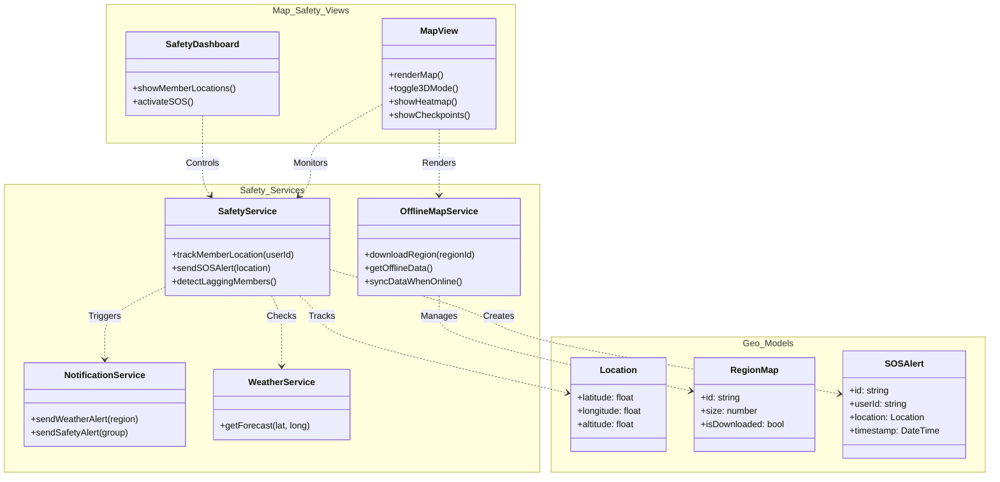

```mermaid
classDiagram
    direction TB

    namespace Map_Safety_Views {
        class MapView {
            +renderMap()
            +toggle3DMode()
            +showHeatmap()
            +showCheckpoints()
        }
        class SafetyDashboard {
            +showMemberLocations()
            +activateSOS()
        }
    }

    namespace Safety_Services {
        class OfflineMapService {
            +downloadRegion(regionId)
            +getOfflineData()
            +syncDataWhenOnline()
        }
        class SafetyService {
            +trackMemberLocation(userId)
            +sendSOSAlert(location)
            +detectLaggingMembers()
        }
        class NotificationService {
            +sendWeatherAlert(region)
            +sendSafetyAlert(group)
        }
        class WeatherService {
            +getForecast(lat, long)
        }
    }

    namespace Geo_Models {
        class Location {
            +latitude: float
            +longitude: float
            +altitude: float
        }
        class RegionMap {
            +id: string
            +size: number
            +isDownloaded: bool
        }
        class SOSAlert {
            +id: string
            +userId: string
            +location: Location
            +timestamp: DateTime
        }
    }

    MapView ..> OfflineMapService : Renders
    MapView ..> SafetyService : Monitors
    SafetyDashboard ..> SafetyService : Controls
    SafetyService ..> NotificationService : Triggers
    SafetyService ..> WeatherService : Checks
    
    OfflineMapService ..> RegionMap : Manages
    SafetyService ..> SOSAlert : Creates
    SafetyService ..> Location : Tracks
```
