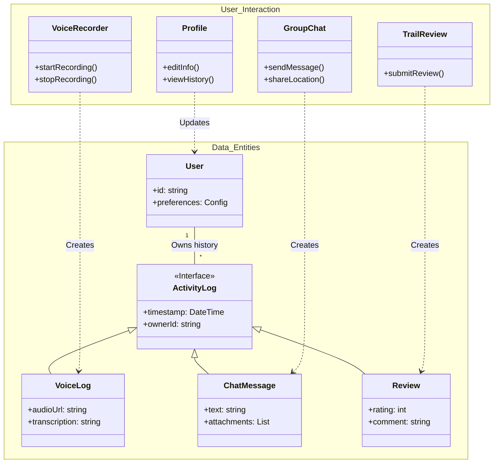

```mermaid
classDiagram
direction TB
	namespace User_Interaction {
        class Profile {
	        +editInfo()
	        +viewHistory()
        }

        class VoiceRecorder {
	        +startRecording()
	        +stopRecording()
        }

        class GroupChat {
	        +sendMessage()
	        +shareLocation()
        }

        class TrailReview {
	        +submitReview()
        }

	}
	namespace Data_Entities {
        class User {
	        +id: string
	        +preferences: Config
        }

        class ActivityLog {
	        +timestamp: DateTime
	        +ownerId: string
        }

        class VoiceLog {
	        +audioUrl: string
	        +transcription: string
        }

        class ChatMessage {
	        +text: string
	        +attachments: List
        }

        class Review {
	        +rating: int
	        +comment: string
        }

	}

	<<Interface>> ActivityLog

    Profile ..> User : Updates
    ActivityLog <|-- VoiceLog
    ActivityLog <|-- ChatMessage
    ActivityLog <|-- Review
    VoiceRecorder ..> VoiceLog : Creates
    GroupChat ..> ChatMessage : Creates
    TrailReview ..> Review : Creates
    User "1" -- "*" ActivityLog : Owns history
```