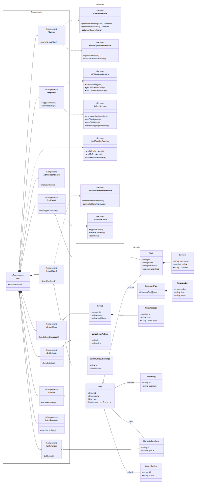

# Project Proposal

## 2 Preliminary Problem Statement

### 2.1 Problem Description

Trong những năm gần đây, phong trào du lịch tự túc, khám phá thiên nhiên, hay còn gọi là "phượt," đặc biệt là các hoạt động như trekking, hiking, cắm trại, đã và đang phát triển mạnh mẽ tại Việt Nam. Hoạt động này không chỉ giúp nâng cao sức khỏe thể chất, tinh thần mà còn là cơ hội để mọi người kết nối với thiên nhiên và khám phá những vẻ đẹp tiềm ẩn của đất nước.

Tuy nhiên, sự phát triển nhanh chóng này cũng kéo theo nhiều thách thức và vấn đề mà cộng đồng phượt thủ, từ những người mới bắt đầu đến những người có kinh nghiệm, đang phải đối mặt:

*   **Thông tin phân mảnh và thiếu tin cậy:** Các thông tin quan trọng về cung đường (bản đồ, độ khó, nguồn nước, cảnh báo) bị phân tán trên nhiều nền tảng không chính thức như mạng xã hội, blog cá nhân, khiến việc tìm kiếm và xác thực trở nên khó khăn.
*   **Rủi ro về an toàn trong chuyến đi:** Việc thiếu các công cụ hỗ trợ chuyên dụng, đặc biệt là bản đồ và định vị GPS có thể hoạt động ở những khu vực không có sóng di động, làm gia tăng nguy cơ lạc đường và các sự cố đáng tiếc.
*   **Khó khăn trong lập kế hoạch:** Người đi phượt, nhất là những người mới, thường mất nhiều thời gian để nghiên cứu, lựa chọn cung đường phù hợp và chuẩn bị cho chuyến đi một cách hiệu quả.
*   **Tính kết nối cộng đồng thấp:** Các kinh nghiệm và kiến thức quý báu thường bị trôi đi nhanh chóng trên mạng xã hội, thiếu một nơi lưu trữ, chia sẻ và học hỏi lẫn nhau một cách có hệ thống.

Từ những vấn đề trên, nhóm đề xuất xây dựng một "Hệ thống hỗ trợ du lịch phượt". Đây là một ứng dụng web và di động hoạt động như một nền tảng all-in-one, cung cấp thông tin chi tiết và công cụ điều hướng an toàn, đồng thời hỗ trợ một không gian cộng đồng vững mạnh cho những người yêu thích hoạt động ngoài trời tại Việt Nam.

Hệ thống sẽ tập trung vào ba mục tiêu chính:

1.  **Cung cấp một thư viện cung đường toàn diện và đáng tin cậy:** Nền tảng sẽ tổng hợp, chuẩn hóa và hiển thị thông tin chi tiết về các cung đường, cho phép người dùng dễ dàng tìm kiếm, khám phá và lên kế hoạch cho chuyến đi của mình.
2.  **Nâng cao an toàn thông qua công cụ điều hướng hiện đại:** Hệ thống tích hợp các công cụ bản đồ và định vị GPS, đặc biệt chú trọng vào khả năng hoạt động ngoại tuyến (offline) để hỗ trợ người dùng ngay cả ở những vùng sâu vùng xa.
3.  **Xây dựng một cộng đồng chia sẻ và hỗ trợ:** Tạo ra một không gian để người dùng có thể chia sẻ lại nhật ký hành trình, đánh giá, cập nhật thông tin thực tế về các cung đường, và kết nối với những người cùng đam mê.

Mục tiêu cuối cùng là làm cho hoạt động du lịch phượt trở nên an toàn hơn, dễ tiếp cận hơn và có tính cộng đồng cao hơn cho tất cả mọi người.

### 2.2 Technical Overview

Hệ thống được thiết kế theo kiến trúc client-server hiện đại, nhằm phục vụ người dùng trên cả hai nền tảng chính là web và di động.

Giao diện người dùng trên nền tảng web sẽ được xây dựng bằng JavaScript với framework ReactJS, đảm bảo trải nghiệm tương tác, linh hoạt và đáp ứng tốt trên các trình duyệt hỗ trợ HTML5. Để tối ưu hóa quá trình phát triển và bảo trì, ứng dụng di động cho cả Android và iOS sẽ được phát triển bằng React Native. Lựa chọn này cho phép chia sẻ một phần lớn logic và thành phần giao diện giữa hai nền tảng di động, đồng thời đồng bộ với hệ sinh thái công nghệ của phiên bản web.

Phía backend, đóng vai trò xử lý toàn bộ logic nghiệp vụ và cung cấp dữ liệu cho các client, sẽ được triển khai bằng ngôn ngữ Java với Spring Boot Framework. Kiến trúc này cho phép xây dựng các API (Application Programming Interface) theo chuẩn RESTful một cách mạnh mẽ và có khả năng mở rộng cao. Toàn bộ hệ thống back-end sẽ được triển khai trên môi trường máy chủ sử dụng hệ điều hành Linux (Ubuntu), với Apache hoặc Nginx làm web server, và được vận hành trên nền tảng điện toán đám mây (ví dụ: AWS) để đảm bảo tính sẵn sàng và linh hoạt.

Về lưu trữ dữ liệu, hệ thống sẽ sử dụng Hệ quản trị cơ sở dữ liệu quan hệ PostgreSQL. Lựa chọn này được đưa ra không chỉ vì sự ổn định và toàn vẹn dữ liệu mà còn vì khả năng mở rộng mạnh mẽ của nó với PostGIS. Extension này cung cấp các kiểu dữ liệu và hàm chuyên dụng để lưu trữ và truy vấn hiệu quả các dữ liệu không gian địa lý như tọa độ GPS, đường đi (tracks) và các điểm trên bản đồ, vốn là yêu cầu cốt lõi của bài toán.

Trong suốt quá trình phát triển, các tiêu chuẩn về tài liệu sẽ được tuân thủ, bao gồm việc sử dụng biểu đồ UML cho tài liệu thiết kế và các chuẩn chú thích mã nguồn như Javadoc (cho Java) và JSDoc (cho JavaScript) để đảm bảo tính dễ đọc và bảo trì của dự án.

Việc lựa chọn các công nghệ trên không chỉ đảm bảo khả năng mở rộng, mà còn giúp nhóm phát triển triển khai nhanh chóng và dễ dàng bảo trì hệ thống trong giai đoạn sau.

---

## 3 Proposed Solution

### 3.1 Software

#### 3.1.1. Features

| STT  | Nhu cầu                                                                                                                                                                                                                        | Yêu cầu                               |
| :--- | :----------------------------------------------------------------------------------------------------------------------------------------------------------------------------------------------------------------------------- | :------------------------------------ |
| 1    | Là một người dùng, tôi muốn đăng ký tài khoản cá nhân và tạo hồ sơ người dùng.                                                                                                                                                 | Đăng ký/ Đăng nhập hồ sơ người dùng.  |
| 2    | Là một người dùng, tôi muốn tìm kiếm các địa điểm trekking.                                                                                                                                                                    | Tìm kiếm, khám phá các địa điểm.      |
| 3    | Là một người dùng, tôi muốn tìm mua hoặc bán lại các trang bị đi phượt đã qua sử dụng với những thành viên khác trong cộng đồng.                                                                                               | Chợ đồ phượt.                         |
| 4    | Là một người dùng đang trekking, tôi muốn ghi lại nhanh nhật ký bằng giọng nói và nó được tự động ghim vào vị trí hiện tại của tôi trên bản đồ.                                                                                | Nhật ký giọng nói và gắn thẻ địa lý.  |
| 5    | Là một người dùng, tôi muốn tải sẵn bản đồ và dữ liệu cung đường để có thể xem và định vị ngay cả khi không có kết nối Internet.                                                                                               | Bản đồ offline.                       |
| 6    | Là người dùng, tôi muốn đánh dấu những địa điểm tôi thích trên cung đường để lưu lại cho lần sau hoặc chia sẻ với bạn bè.                                                                                                      | Đánh dấu điểm yêu thích.              |
| 7    | Là người dùng đã đăng ký, tôi muốn xem lại lịch sử các chuyến đi của mình, tổng số km đã đi, độ cao trung bình và thời gian trung bình mỗi cung đường.                                                                         | Thống kê cá nhân.                     |
| 8    | Là người dùng, tôi muốn so sánh hai cung đường để biết cung nào phù hợp hơn với thời gian, độ khó và phong cảnh tôi muốn.                                                                                                      | Lọc kết quả.                          |
| 9    | Là người dùng, tôi muốn nhận thông báo khi cung đường tôi chọn có thời tiết xấu, sạt lở hoặc đang đóng cửa, để tránh gặp rủi ro.                                                                                               | Cập nhật thông tin thời gian thực.    |
| 10   | Là người dùng mới, tôi muốn có mục hướng dẫn cơ bản về kỹ năng trekking, cắm trại và sơ cứu để chuẩn bị an toàn trước khi đi.                                                                                                  | Sách hướng dẫn.                       |
| 11   | Là một người dùng, tôi muốn xem thông tin chi tiết về một cung đường, bao gồm mô tả, hình ảnh, và đánh giá của người khác, để tôi quyết định xem nó có phù hợp với mình không.                                                 | Trang chi tiết cung đường.            |
| 12   | Là người dùng đã đăng ký, tôi muốn theo dõi hồ sơ của những trekker khác và xem nhật ký hành trình (feed) của họ để lấy cảm hứng.                                                                                              | Mạng xã hội.                          |
| 13   | Là một quản trị viên, tôi muốn xem xét và phê duyệt các cung đường mới do người dùng đóng góp để đảm bảo thông tin chính xác và an toàn.                                                                                       | Dashboard duyệt/sửa/xóa nội dung.     |
| 14   | Là một người dùng, tôi phát hiện ra một cung đường trên bản đồ đã bị thay đổi (ví dụ: có một con đường mới hoặc một đoạn bị chặn) và tôi muốn đóng góp thông tin này cho cộng đồng.                                            | Đóng góp và chỉnh sửa lộ trình.       |
| 15   | Là một người dùng, tôi đã lên danh sách các địa điểm muốn tham quan nhưng không biết sắp xếp chúng theo ngày thế nào cho hợp lý để tiết kiệm thời gian di chuyển.                                                              | Tối ưu hóa lộ trình.                  |
| 16   | Là người mới hoặc người bận rộn, tôi muốn ứng dụng tự động tạo một lịch trình chi tiết cho chuyến đi nhiều ngày, bao gồm gợi ý điểm cắm trại, phân bổ quãng đường mỗi ngày dựa trên thể lực của tôi và thời gian mặt trời lặn. | Trợ lí lập kế hoạch thông minh.       |
| 17   | Là trưởng nhóm của chuyến đi, tôi muốn thiết lập các điểm hẹn (checkpoint) và nhận cảnh báo tự động nếu có thành viên bị tụt lại quá xa hoặc không di chuyển trong một khoảng thời gian nhất định.                             | Đồng bộ hóa và cảnh báo an toàn.      |
| 18   | Là một người dùng năng động, tôi muốn tham gia các thử thách trekking (ví dụ: "chinh phục 100km trong tháng") để có thêm động lực và cạnh tranh với bạn bè.                                                                    | Thử thách cộng đồng và bảng xếp hạng. |
| 19   | Là người dùng đã đăng ký, tôi muốn tạo nhóm và mời bạn bè cùng tham gia một chuyến đi, để chúng tôi có thể theo dõi vị trí và liên lạc trong suốt hành trình.                                                                  | Tạo nhóm.                             |
| 20   | Là một người dùng, tôi muốn xem dự báo thời tiết tại địa điểm trekking để tôi chuẩn bị trang phục và lịch trình phù hợp.                                                                                                       | Tích hợp dự báo thời tiết.            |
| 21   | Là người dùng đã đăng ký, tôi muốn tạo một danh sách kiểm tra (checklist) trang bị cho chuyến đi của mình để đảm bảo tôi không bỏ quên thứ gì quan trọng.                                                                      | Checklist trang bị.                   |
| 22   | Là người dùng, tôi muốn app tự động tạo một video/câu chuyện tóm tắt chuyến đi của tôi, dựa trên lộ trình và những bức ảnh tôi đã chụp.                                                                                        | Tạo nhật ký hành trình tự động.       |
| 23   | Là một người dùng, tôi muốn tìm một cung đường ít người qua lại để tận hưởng sự yên tĩnh, hoặc ngược lại, tôi muốn biết những con đường nào đang phổ biến nhất gần đây để tham gia.                                            | Bản đồ nhiệt cộng đồng.               |
| 24   | Là một người dùng, tôi đang lên kế hoạch trekking cùng nhóm bạn và gặp khó khăn trong việc chia sẻ ý tưởng, thống nhất lịch trình.                                                                                             | Lập kế hoạch.                         |
| 25   | Là một người dùng, tôi muốn hình dung rõ hơn về địa hình và độ dốc của cung đường trước khi đi để chuẩn bị thể lực tốt hơn.                                                                                                    | Xem trước lộ trình với bản đồ 3D.     |
| 26   | Là một người dùng đi phượt dài ngày, tôi muốn kích hoạt một chế độ siêu tiết kiệm pin để đảm bảo việc ghi lại lộ trình không làm điện thoại của tôi hết pin.                                                                   | Chế độ tiết kiệm pin tối đa.          |
| 27   | Là người dùng đã đăng ký, tôi muốn được gợi ý những cung đường phù hợp với sở thích, thể lực và lịch sử trekking của tôi, thay vì phải tự lọc thủ công.                                                                        | Cá nhân hóa.                          |
| 28   | Là người dùng, tôi muốn thời gian tải bản đồ và chi tiết cung đường không quá 3 giây để tôi không phải chờ đợi lâu.                                                                                                            | Tối ưu hóa hiệu suất.                 |
| 29   | Là một người dùng, tôi muốn tìm thêm các gợi ý về địa điểm ăn uống hoặc tham quan thú vị gần những cung đường tôi đã lên kế hoạch đến.                                                                                         | Khám phá và gợi ý thông minh.         |

#### 3.1.2. Software Architecture

##### 3.1.2.1 Overview
Hệ thống được thiết kế theo mô hình client - server đa tầng, bao gồm các thành phần chính: Giao diện người dùng (UI), Máy chủ ứng dụng (Application Server), Máy chủ trí tuệ nhân tạo (AI Server) và Cơ sở dữ liệu trung tâm (PostgreSQL).

Mục tiêu của kiến trúc là đảm bảo khả năng mở rộng, phân tách trách nhiệm rõ ràng, và tăng cường tính bảo mật trong việc xác thực và quản lý dữ liệu người dùng.

##### 3.1.2.2 Overall Architecture

*   **Giao diện người dùng:** Là tầng tiếp xúc trực tiếp với người dùng cuối. Giao diện cho phép người dùng đăng ký, đăng nhập, tìm kiếm, lên kế hoạch hành trình, xem bản đồ, và nhận các gợi ý thông minh. Các yêu cầu từ giao diện sẽ được gửi đến Application Server thông qua API sử dụng giao thức HTTP/HTTPS.
*   **Máy chủ ứng dụng:** Là trung tâm điều phối toàn bộ hoạt động của hệ thống. Thành phần này chịu trách nhiệm:
    *   Quản lý xác thực và phân quyền người dùng.
    *   Xử lý các yêu cầu nghiệp vụ như: tìm kiếm, tối ưu hóa lộ trình, thống kê cá nhân, quản lý nhật ký chuyến đi, và tương tác nhóm.
    *   Kết nối và trao đổi dữ liệu với cơ sở dữ liệu PostgreSQL và AI Server để cung cấp kết quả chính xác, cá nhân hóa.
    *   *Máy chủ ứng dụng được chia thành ba nhóm tính năng chính:*
        *   **Tính năng không cần xác thực:** người dùng có thể truy cập mà không cần đăng nhập, bao gồm tìm kiếm, dự báo thời tiết, bản đồ offline, và chế độ tiết kiệm pin.
        *   **Tính năng cần xác thực:** chỉ dành cho người dùng đã đăng nhập, bao gồm lọc kết quả, tối ưu hóa hiệu suất, chợ đồ phượt, và gợi ý hành trình thông minh.
        *   **Tính năng xác thực một phần:** yêu cầu xác thực trong một số ngữ cảnh, như cập nhật dữ liệu thời gian thực hoặc chia sẻ hành trình.
*   **Máy chủ trí tuệ nhân tạo:** Là thành phần chuyên trách xử lý và phân tích dữ liệu nâng cao. AI Server giao tiếp với Application Server qua API nội bộ, đảm bảo luồng dữ liệu được bảo mật và hiệu quả. AI Server sử dụng các mô hình học máy để:
    *   Trợ lý lập kế hoạch thông minh.
    *   Cá nhân hóa các gợi ý cung đường dựa trên hành vi và sở thích của người dùng.
    *   Cập nhật thông tin thời gian thực.
    *   Cung cấp chức năng xem trước lộ trình trên bản đồ 3D.
    *   Khám phá và gợi ý thông minh.
    *   Tạo nhật ký hành trình tự động.
*   **CSDL PostgreSQL:** Toàn bộ dữ liệu hệ thống được lưu trữ trong cơ sở dữ liệu PostgreSQL, bao gồm thông tin người dùng, nhật ký hành trình, thống kê, bản đồ, và dữ liệu phục vụ huấn luyện mô hình AI.

##### 3.1.2.3 Authentication and Authorization
Hệ thống sử dụng cơ chế xác thực dựa trên JSON Web Token (JWT).
*   Khi người dùng đăng nhập, Application Server tạo ra một token JWT và gửi về phía client thông qua cookie bảo mật (httpOnly).
*   Các yêu cầu tới các API yêu cầu quyền truy cập sẽ được xác minh token trước khi xử lý.
*   Token có thời hạn hiệu lực nhất định (ví dụ 24 giờ), sau đó người dùng cần đăng nhập lại.
Cách làm này giúp tăng cường tính bảo mật và giảm thiểu nguy cơ tấn công giả mạo (CSRF hoặc XSS).

##### 3.1.2.4 General workflow
*   Người dùng truy cập giao diện và thực hiện hành động (đăng nhập, tìm kiếm, lên kế hoạch,...). Yêu cầu được gửi đến Application Server, nơi kiểm tra tính hợp lệ của token (nếu có).
*   Application Server xử lý nghiệp vụ, đồng thời:
    *   Gửi yêu cầu truy vấn hoặc cập nhật tới PostgreSQL.
    *   Gửi yêu cầu phân tích, dự đoán, hoặc tối ưu đến AI Server nếu cần.
*   AI Server trả về kết quả gợi ý hoặc dự đoán cho Application Server.
*   Application Server tổng hợp kết quả và gửi phản hồi lại cho giao diện người dùng.

##### 3.1.2.5 Advantages of Architecture
*   **Phân tầng rõ ràng:** Dễ bảo trì, mở rộng và thay thế từng thành phần mà không ảnh hưởng toàn hệ thống.
*   **Bảo mật cao:** Tách riêng module xác thực, sử dụng JWT và cookie an toàn.
*   **Tích hợp AI linh hoạt:** Cho phép AI Server mở rộng độc lập để xử lý nâng cao mà không làm gián đoạn hệ thống chính.
*   **Khả năng mở rộng ngang:** Application Server và AI Server có thể triển khai song song để tăng tải.
*   **Hiệu năng ổn định:** PostgreSQL cung cấp khả năng xử lý truy vấn tối ưu và bảo toàn dữ liệu mạnh mẽ.

### 3.2 Hardware

Để ứng dụng hoạt động ổn định và tận dụng tối đa các tính năng đã đề xuất, hệ thống cần đáp ứng các yêu cầu về phần cứng và thiết bị sau đây:

#### 3.2.1 User-side Requirements
Ứng dụng được thiết kế để chạy chủ yếu trên nền tảng di động (iOS & Android). Các yêu cầu tối thiểu và đề xuất cho thiết bị của người dùng như sau:

| Thành phần   | Yêu cầu tối thiểu                               | Yêu cầu đề xuất                                                                                                                               |
| :----------- | :---------------------------------------------- | :-------------------------------------------------------------------------------------------------------------------------------------------- |
| Thiết bị     | Smartphone Android 8.0 (API 26+) hoặc iOS 14.0+ | Smartphone Android 12+ hoặc iPhone đời từ Xs trở lên.                                                                                         |
| CPU          | 4 nhân, 1.8 GHz                                 | 8 nhân, 2.2 GHz trở lên để xử lý mượt mà kết xuất bản đồ 3D, các tác vụ AI trên thiết bị, và giao diện người dùng nói chung.                  |
| RAM          | 3 GB                                            | 6 GB trở lên để đảm bảo khả năng đa nhiệm, cho phép ứng dụng chạy ngầm ghi lại lộ trình GPS trong khi người dùng sử dụng các ứng dụng khác.   |
| Bộ nhớ trống | 2 GB                                            | 5 GB (để lưu bản đồ offline, ảnh, video)                                                                                                      |
| Cảm biến     | GPS/GNSS, Gia tốc kế, Con quay hồi chuyển.      | GPS/GNSS (A-GPS, GLONASS), Gia tốc kế, Con quay hồi chuyển, La bàn số, Cảm biến ánh sáng.                                                     |
| Kết nối      | 4G/LTE, Wi-Fi                                   | 5G, Wi-Fi 802.11ac                                                                                                                            |
| Pin          | 3000 mAh                                        | 4000 mAh trở lên (đáp ứng chuyến đi dài ngày vì các tính năng như theo dõi GPS liên tục và hiển thị bản đồ 3D tiêu thụ rất nhiều năng lượng). |

#### 3.2.2 Server-side Requirements
Để hỗ trợ các tính năng phức tạp đồng bộ hóa thời gian thực, và xử lý dữ liệu không gian địa lý, hệ thống máy chủ xây dựng trên nền tảng điện toán đám mây với kiến trúc microservices. Sử dụng API từ Google Studio AI để xử lý các tác vụ AI.

| Hạng mục                     | Thành phần       | Yêu cầu kỹ thuật                                                                                                                                                                 |
| :--------------------------- | :--------------- | :------------------------------------------------------------------------------------------------------------------------------------------------------------------------------- |
| **Cấu hình máy chủ**         | CPU              | Tối thiểu 8 nhân:   - 4 cores cho ứng dụng và API services.   - 2 cores cho xử lý AI và tác vụ nền.   - 2 cores cho Database.                                           |
|                              | RAM              | Tối thiểu 32GB:   - 16GB cho ứng dụng, database, và cache.   - 8GB-16GB dự phòng cho AI models (khi chạy).                                                                 |
|                              | Storage          | - SSD: 512GB (Hệ điều hành và applications).   - NVMe: 1TB (Database và cache, khuyến nghị RAID 10).   - HDD: 2TB (Lưu trữ dữ liệu người dùng, bản đồ offline, và backup). |
| **Kết nối mạng**             | Băng thông       | Tối thiểu 1Gbps (Đảm bảo tải bản đồ và đồng bộ real-time).                                                                                                                       |
|                              | Kết nối          | Mạng dự phòng và bộ cân bằng tải cho phân phối tải.                                                                                                                              |
| **Hệ điều hành và Phần mềm** | Hệ điều hành     | Ubuntu 22.04 LTS hoặc CentOS 8.                                                                                                                                                  |
|                              | Containerization | Docker với Docker Compose.                                                                                                                                                       |
|                              | Điều phối        | Kubernetes (Cho quản lý microservices).                                                                                                                                          |
| **Database**                 | Database chính   | PostgreSQL Cluster. Có extension PostGIS cho dữ liệu địa lý.                                                                                                                     |
|                              | Lớp cache        | Redis Cluster (Quản lý session, cache vị trí real-time, cache dữ liệu bản đồ).                                                                                                   |

---

## 4 Development Plan

### 4.1 Requirements Analysis
*   **Mục tiêu:** Hiểu rõ và đặc tả chi tiết các yêu cầu chức năng (hệ thống làm gì) và phi chức năng (hệ thống hoạt động như thế nào), làm nền tảng cho việc thiết kế và lập trình.
*   **Thời gian:** 26/10/2025 - 15/11/2025 (sau khi đã nộp template0).
*   **Kế hoạch chi tiết:**

| Công việc                        | Mô tả chi tiết                                                                                                                              | Phân công         | Đầu ra                                                                    |
| :------------------------------- | :------------------------------------------------------------------------------------------------------------------------------------------ | :---------------- | :------------------------------------------------------------------------ |
| **Xác định các bên liên quan**   | Liệt kê và mô tả vai trò của người dùng cuối (phượt thủ), quản trị viên, và các bên liên quan khác.                                         | Team BA           | Mục 3.1 (Stakeholders) trong Template1.                                   |
| **Đặc tả yêu cầu chức năng**     | Liệt kê và nhóm các tính năng chính: tìm kiếm, hiển thị bản đồ, GPS tracking, tải bản đồ offline, quản lý hồ sơ,...                         | Team BA           | Mục 3.2.1 (Functional Requirements Specification) trong Template1.        |
| **Đặc tả yêu cầu phi chức năng** | Xác định các yêu cầu về hiệu năng (GPS chính xác), tính khả dụng, bảo mật, hoạt động offline.                                               | Team BA           | Mục 3.2.2 (Non-Functional Requirements Specification) trong Template1.    |
| **Mô hình hóa Use Case**         | Vẽ biểu đồ Use Case tổng thể và viết đặc tả chi tiết cho các Use Case quan trọng nhất (ví dụ: "Tìm kiếm cung đường", "Ghi lại hành trình"). | Team BA, Designer | Mục 4.1 (Use Case model) và 4.2 (Use Case Specification) trong Template1. |
| **Thiết kế giao diện sơ bộ**     | Vẽ các bản phác thảo (wireframe) và thiết kế giao diện (mockup) cho các màn hình chính của ứng dụng.                                        | Team UI/UX        | Mục 5 (Prototype/ Mockup) trong Template1.                                |

*   **Kết quả mong muốn:** Template1 hoàn chỉnh, sẵn sàng để nộp vào ngày 15/11/2025.

### 4.2 Software Design
*   **Mục tiêu:** Chuyển hóa các yêu cầu thành một bản thiết kế kỹ thuật chi tiết, mô tả kiến trúc, cơ sở dữ liệu và giao diện của hệ thống.
*   **Thời gian:** 23/11/2025 - 13/12/2025
*   **Kế hoạch chi tiết:**

| Công việc                        | Mô tả chi tiết                                                                                              | Phân công    | Đầu ra                                |
| :------------------------------- | :---------------------------------------------------------------------------------------------------------- | :----------- | :------------------------------------ |
| **Thiết kế kiến trúc**           | Vẽ sơ đồ kiến trúc tổng thể, xác định các thành phần chính (Mobile App, Web App, Backend Server, Database). | Team Backend | Sơ đồ kiến trúc                       |
| **Thiết kế dữ liệu**             | Thiết kế sơ đồ quan hệ thực thể (ERD) cho CSDL PostgreSQL, đặc tả chi tiết các bảng và thuộc tính.          | Team Backend | Sơ đồ ERD, đặc tả CSDL                |
| **Thiết kế lớp / Class Diagram** | Vẽ biểu đồ lớp để mô tả các lớp đối tượng chính trong hệ thống và mối quan hệ giữa chúng.                   | Team Backend | Class Diagram                         |
| **Thiết kế giao diện chi tiết**  | Hoàn thiện thiết kế giao diện người dùng chi tiết dựa trên các mockup đã có.                                | Team UI/UX   | Sơ đồ luồng màn hình (Screen Diagram) |

*   **Kết quả mong muốn:** Template2 hoàn chỉnh, sẵn sàng để nộp vào ngày 13/12/2025.

### 4.3 Implementation
*   **Mục tiêu:** Lập trình, xây dựng các thành phần và tính năng của sản phẩm dựa trên bản thiết kế đã được phê duyệt.
*   **Thời gian:** 14/12/2025 - 03/01/2026
*   **Kế hoạch chi tiết:**

| Nhóm chức năng                     | Mô tả chi tiết                                                                                                                                                                                                      | Phân công                              | Đầu ra                                                                                                                          |
| :--------------------------------- | :------------------------------------------------------------------------------------------------------------------------------------------------------------------------------------------------------------------ | :------------------------------------- | :------------------------------------------------------------------------------------------------------------------------------ |
| **Nền tảng và quản lý người dùng** | - Setup project, CI/CD, cơ sở dữ liệu.   - Xây dựng chức năng đăng ký, đăng nhập, quản lý hồ sơ.   - Tạo giao diện trang hồ sơ cá nhân, cho phép chỉnh sửa thông tin cơ bản.                                  | Cả nhóm                                | - Source code chức năng xác thực và quản lý tài khoản.   - Ứng dụng có thể đăng ký, đăng nhập.                               |
| **Tìm kiếm và điều hướng**         | - Tích hợp bản đồ.   - Xây dựng bộ lọc tìm kiếm cung đường (địa điểm, độ khó...).   - Phát triển tính năng hiển thị chi tiết cung đường và các POI trên bản đồ.   - Xây dựng tính năng tải bản đồ offline. | Team Frontend, Backend                 | - Giao diện tìm kiếm và bản đồ hoạt động.   - Người dùng có thể xem danh sách, chi tiết các cung đường và tải bản đồ về máy. |
| **Trải nghiệm hành trình**         | - Xây dựng chức năng ghi lại hành trình (tracking).   - Lưu lại nhật ký hành trình (quãng đường, thời gian, độ cao).   - Phát triển tính năng an toàn: Chia sẻ vị trí trực tiếp (live tracking).              | Team Frontend (chuyên Mobile), Backend | - Ứng dụng có thể ghi lại và lưu trữ lộ trình di chuyển của người dùng.   - Tính năng an toàn hoạt động ở mức cơ bản.        |
| **Tương tác cộng đồng**            | - Xây dựng chức năng đăng bài đánh giá, xếp hạng cho cung đường.   - Thêm tính năng bình luận, trả lời bình luận.   - Phát triển hệ thống bạn bè, theo dõi và chia sẻ hoạt động cá nhân.                      | Cả nhóm                                | - Người dùng có thể tương tác (đánh giá, bình luận) trên các cung đường.   - Chức năng Mạng xã hội hoạt động.                |
| **Tính năng nâng cao và quản trị** | - Xây dựng thuật toán và tích hợp API để gợi ý cung đường cá nhân hóa.   - Xây dựng trang quản trị (Admin panel) đơn giản để quản lý người dùng, cung đường và các báo cáo vi phạm.                              | Team Backend, AI, Frontend             | - Hệ thống gợi ý hoạt động ở mức cơ bản.   - Trang Admin có thể truy cập và thực hiện các thao tác quản lý cơ bản.           |

*   **Kết quả mong muốn:**
    *   Mã nguồn của sản phẩm được quản lý và cập nhật liên tục trên Git.
    *   Một phiên bản phần mềm có thể hoạt động với các nhóm chức năng đã được hiện thực hóa, sẵn sàng cho giai đoạn kiểm thử toàn diện.

### 4.4 Testing
*   **Mục tiêu:** Đảm bảo chất lượng sản phẩm, triển khai và hoàn thiện các tài liệu cuối cùng để kết thúc dự án.
*   **Thời gian:** 04/01/2026 - 10/01/2026
*   **Kế hoạch chi tiết:**

| Công việc                             | Mô tả chi tiết                                                                                                                              | Phân công          | Đầu ra                                                      |
| :------------------------------------ | :------------------------------------------------------------------------------------------------------------------------------------------ | :----------------- | :---------------------------------------------------------- |
| **Lập kế hoạch kiểm thử**             | Viết tài liệu kế hoạch kiểm thử và các kịch bản kiểm thử chi tiết cho các chức năng quan trọng.                                             | Team Tester        | Tài liệu kiểm thử, bao gồm test plan và test cases.         |
| **Kiểm thử chức năng và tích hợp**    | - Thực thi các test case để kiểm tra từng chức năng.   - Kiểm tra sự giao tiếp giữa Frontend và Backend qua API có hoạt động đúng không. | Team Tester        | Danh sách các lỗi được ghi nhận trên công cụ quản lý.       |
| **Kiểm thử trải nghiệm người dùng**   | Đánh giá tính dễ sử dụng, sự logic của luồng giao diện. Đặc biệt kiểm tra trên app di động với các tính năng GPS, offline.                  | Team Tester, UI/UX | Báo cáo về trải nghiệm người dùng và các đề xuất cải thiện. |
| **Sửa lỗi**                           | Dựa trên danh sách lỗi đã ghi nhận, các lập trình viên sẽ tiến hành phân tích và sửa lỗi.                                                   | Team Devs          | Các lỗi được sửa và cập nhật trạng thái "Fixed".            |
| **Kiểm tra lại / Regression Testing** | Sau khi lỗi được sửa, Team Tester sẽ kiểm tra lại các chức năng liên quan để đảm bảo việc sửa lỗi không gây ra lỗi mới.                     | Team Tester        | Các lỗi được xác nhận đã sửa xong (trạng thái "Closed").    |

*   **Kết quả mong muốn:**
    *   Sản phẩm phần mềm hoạt động ổn định.
    *   Toàn bộ tài liệu yêu cầu của môn học được hoàn thiện và sẵn sàng để nộp.

### 4.5 Deployment and Maintenance
*   **Mục tiêu:** Đưa sản phẩm vào môi trường hoạt động thực tế, hoàn thiện các tài liệu bàn giao và chuẩn bị cho buổi báo cáo cuối kỳ.
*   **Thời gian:** 11/01/2026 - 25/01/2026
*   **Kế hoạch chi tiết:**

| Công việc                          | Mô tả chi tiết                                                                                                                 | Phân công              | Đầu ra                                                                                               |
| :--------------------------------- | :----------------------------------------------------------------------------------------------------------------------------- | :--------------------- | :--------------------------------------------------------------------------------------------------- |
| **Chuẩn bị môi trường triển khai** | Cấu hình server, cơ sở dữ liệu, tên miền trên nền tảng điện toán đám mây đã chọn.                                              | Team Backend           | Môi trường production sẵn sàng hoạt động.                                                            |
| **Triển khai sản phẩm**            | Đóng gói và cài đặt phiên bản ổn định của sản phẩm lên server, đưa ứng dụng web ra tên miền công khai.                         | Team Backend, Frontend | - Sản phẩm hoạt động live, có thể truy cập qua URL.   - File cài đặt (.apk) cho ứng dụng di động. |
| **Giám sát sau triển khai**        | Theo dõi hoạt động của hệ thống trong những ngày đầu để phát hiện và khắc phục sớm các sự cố phát sinh nếu có.                 | Team Backend           | Hệ thống hoạt động ổn định.                                                                          |
| **Hoàn thiện tài liệu bàn giao**   | - Viết báo cáo tổng kết dự án.   - Viết tài liệu hướng dẫn sử dụng cho người dùng cuối.   - Lập kế hoạch bảo trì cơ bản. | Cả nhóm                | - Báo cáo tổng kết dự án.   - Tài liệu hướng dẫn sử dụng.                                         |
| **Chuẩn bị báo cáo cuối kỳ**       | Chuẩn bị slide thuyết trình, quay video demo sản phẩm và phân công người trình bày.                                            | Cả nhóm                | - Slide thuyết trình.   - Video demo sản phẩm.                                                    |

*   **Kết quả mong muốn:**
    *   Sản phẩm được triển khai thành công và có thể truy cập được.
    *   Toàn bộ tài liệu yêu cầu của môn học được hoàn thiện.
    *   Nhóm sẵn sàng cho buổi thuyết trình và demo cuối kỳ.

---

## 5 Human Resources & Costing Plan

### 5.1 Human Resources

| Vai trò              | Trách nhiệm                                                                                                                                                                                                                                                                                                                                                                                                                                                    | Phụ trách                                                                                             |
| :------------------- | :------------------------------------------------------------------------------------------------------------------------------------------------------------------------------------------------------------------------------------------------------------------------------------------------------------------------------------------------------------------------------------------------------------------------------------------------------------- | :---------------------------------------------------------------------------------------------------- |
| **Project Manager**  | Điều hành và quản lý toàn bộ dự án, lập kế hoạch, đảm bảo tiến độ và phối hợp công việc giữa các thành viên.                                                                                                                                                                                                                                                                                                                                                   | Thái Gia Huy                                                                                          |
| **Business Analyst** | Phân tích yêu cầu của người dùng (phượt thủ), nghiên cứu thị trường các ứng dụng tương tự và đặc tả các yêu cầu chức năng, phi chức năng cho hệ thống.                                                                                                                                                                                                                                                                                                         | Đỗ Trọng Huy                                                                                          |
| **UI/UX Designer**   | Thiết kế giao diện (UI) và trải nghiệm người dùng (UX) cho cả phiên bản Web và Di động. Đảm bảo ứng dụng dễ sử dụng, thân thiện và trực quan, đặc biệt với các tính năng bản đồ và điều hướng.                                                                                                                                                                                                                                                                 | Trịnh Thị Thu Hiền, Hoàng Kim Trí                                                                     |
| **Developer**        | Lập trình và phát triển sản phẩm, được phân chia theo chuyên môn chính:   - **Backend Developer:** Xây dựng server, API, và logic nghiệp vụ bằng Java Spring Boot. Quản lý cơ sở dữ liệu PostgreSQL/PostGIS.   - **Frontend Developer:** Phát triển giao diện người dùng cho trang Web (ReactJS) và ứng dụng di động (React Native).   - **AI Engineer:** Nghiên cứu và xây dựng thuật toán gợi ý cung đường cá nhân hóa dựa trên dữ liệu người dùng. | - Thái Gia Huy (AI)   - Đỗ Trọng Huy (BE)   - Trịnh Thị Thu Hiền (FE)   - Hoàng Kim Trí (BE) |
| **Tester (QA/QC)**   | Kiểm tra và đảm bảo chất lượng của ứng dụng thông qua các phương pháp kiểm thử khác nhau như: kiểm thử chức năng, kiểm thử tính khả dụng, kiểm thử hiệu suất và kiểm thử tính chính xác của dữ liệu GPS.                                                                                                                                                                                                                                                       | Trịnh Thị Thu Hiền, Hoàng Kim Trí                                                                     |
| **Technical Writer** | Soạn thảo tài liệu kỹ thuật của dự án, tài liệu hướng dẫn sử dụng cho người dùng cuối và tài liệu API (nếu có), giúp người dùng và các bên liên quan hiểu rõ hơn về cách sử dụng và hoạt động của hệ thống.                                                                                                                                                                                                                                                    | Thái Gia Huy, Đỗ Trọng Huy                                                                            |

### 5.2 Costing Plan

#### 5.2.1 Development Cost

| Vai trò                 | Số lượng (người) | Tổng số giờ làm việc (ước tính) | Mức lương dự kiến (VNĐ/giờ) | Tổng chi phí (VNĐ) |
| :---------------------- | :--------------: | :-----------------------------: | :-------------------------: | :----------------: |
| Project Manager         |        1         |               100               |           250.000           |     25.000.000     |
| Business Analyst        |        1         |               80                |           220.000           |     17.600.000     |
| UI/UX Designer          |        2         |               120               |           200.000           |     24.000.000     |
| Frontend & AI Developer |        2         |               250               |           300.000           |     75.000.000     |
| Backend Developer       |        2         |               250               |           280.000           |     70.000.000     |
| Tester (QA/QC)          |        2         |               150               |           180.000           |     27.000.000     |
| **Tổng cộng (VNĐ)**     |                  |                                 |                             |  **238.600.000**   |

#### 5.2.2 Operational & Maintenance Cost

| Hạng mục                   | Dịch vụ đề xuất                 | Chi phí ước tính (VNĐ/tháng) | Ghi chú                                              |
| :------------------------- | :------------------------------ | :--------------------------: | :--------------------------------------------------- |
| Hạ tầng Máy chủ            | AWS EC2 / Google Compute Engine |           300.000            | Server chạy Backend (Java Spring Boot)               |
| Cơ sở dữ liệu              | AWS RDS for PostgreSQL          |           250.000            | Lưu trữ dữ liệu người dùng, cung đường               |
| Lưu trữ Đa phương tiện     | AWS S3                          |           200.000            | Lưu trữ hình ảnh, video do người dùng tải lên        |
| API Bản đồ                 | Google Maps Platform API        |           500.000            | Cung cấp bản đồ, định vị, gợi ý đường đi             |
| API Trí tuệ nhân tạo       | OpenAI API / Google AI Platform |           400.000            | Chi phí cho tính năng gợi ý cung đường cá nhân hóa   |
| Tên miền                   |                                 |            20.000            | Chi phí quy đổi từ phí hàng năm (khoảng 240.000/năm) |
| Bảo trì & Sửa lỗi          |                                 |           500.000            | Chi phí nhân sự để theo dõi và khắc phục sự cố       |
| **Tổng cộng (hàng tháng)** |                                 |        **2.170.000**         |                                                      |

#### 5.2.3 Budget Summary

| Hạng mục                               |  Chi phí (VNĐ)  | Ghi chú                                                      |
| :------------------------------------- | :-------------: | :----------------------------------------------------------- |
| 1. Tổng chi phí phát triển             |   238.600.000   | Chi phí nhân công một lần để xây dựng sản phẩm.              |
| 2. Chi phí dự phòng (10%)              |   23.860.000    | Dành cho các rủi ro và các yêu cầu phát sinh ngoài kế hoạch. |
| **A. Tổng ngân sách phát triển**       | **262.460.000** | **(1) + (2)**                                                |
| 3. Chi phí vận hành hàng tháng         |    2.170.000    | Chi phí hạ tầng và dịch vụ hàng tháng.                       |
| **B. Tổng chi phí vận hành (năm đầu)** | **26.040.000**  | **(3) x 12 tháng**                                           |
| **Tổng chi phí dự kiến (năm đầu)**     | **288.500.000** | **(A) + (B)**                                                |

---

## 6 Tools setup

| Tên công cụ      | Mô tả chi tiết                                                                                                                                                                                                                                                             | Link                   |
| :--------------- | :------------------------------------------------------------------------------------------------------------------------------------------------------------------------------------------------------------------------------------------------------------------------- | :--------------------- |
| **Google Meet**  | Sử dụng cho các cuộc họp nhóm định kỳ hàng tuần và các buổi thảo luận chuyên sâu cần trao đổi trực tiếp.                                                                                                                                                                   | [Link Google Meet](#)  |
| **Google Drive** | Là kho lưu trữ toàn bộ tài liệu và các sản phẩm của dự án. Các thư mục trên Drive được tổ chức như sau:   ● /Archive: Lưu trữ tài liệu tham khảo của các khóa trước.   ● /Public: Lưu trữ tài liệu của giảng viên.   ● /Sources: Lưu trữ tài liệu chung của nhóm. | [Link Google Drive](#) |
| **Github**       | Được sử dụng làm hệ thống quản lý mã nguồn cho toàn bộ dự án. GitHub hỗ trợ cộng tác nhóm, theo dõi lịch sử commit, và quản lý issue.                                                                                                                                      | [Link Github](#)       |
| **Draw.io**      | Dùng để thiết kế sơ đồ UML, kiến trúc hệ thống, và giao diện người dùng. Các sơ đồ được lưu trên Google Drive để dễ chia sẻ và chỉnh sửa theo thời gian thực.                                                                                                              | [Link Draw.io](#)      |
| **Messenger**    | Sử dụng cho trao đổi nhanh giữa các thành viên khi cần phản hồi gấp hoặc thông báo trong và ngoài giờ làm việc. Là kênh liên lạc chính thức của các thành viên trong nhóm.                                                                                                 | [Link Messenger](#)    |
| **Telegram**     | Được dùng như kênh thông báo và liên lạc chính thức giữa nhóm và TA, đảm bảo kết nối liên tục. Có thể dùng để chia sẻ tệp nhỏ hoặc nhắc lịch làm việc.                                                                                                                     | [Link Telegram](#)     |
| **Moodle**       | Nền tảng chính của môn học, dùng để đăng tải và nộp bài tập.                                                                                                                                                                                                               | [Link Moodle](#)       |
| **Outlook**      | Nền tảng thư trực tuyến để nhận thông báo của giảng viên, TAs cũng như phúc khảo.                                                                                                                                                                                          | [Link Outlook](#)      |

---

## 2 Conceptual Model (Mô hình quan niệm)

*(Sơ đồ bao gồm các thực thể chính như: User, Route, Trip, Gear Items, Challenges, Track Log, Review, Preference Warehouse, Marketplace Item, và các mối quan hệ giữa chúng).*

---

## 3 Architectural Design (Thiết kế kiến trúc)

### 3.1 Architecture Diagram

Hệ thống TrailsExplorer được phân rã thành các phân hệ chính:
1.  **Phân hệ Quản lý người dùng:** Thông tin cá nhân, Đăng ký/Đăng nhập, Lịch sử trekking, Thành tích.
2.  **Phân hệ Thương mại:** Đăng bán, Tìm mua, Liên hệ.
3.  **Phân hệ Cộng đồng và tương tác:** Mạng xã hội (Thêm bạn, Nhắn tin), Đóng góp dữ liệu, Thử thách cộng đồng.
4.  **Phân hệ Tìm kiếm khám phá:** AI cá nhân hóa (Gợi ý cung đường), Tra cứu, Trực quan hóa (Bản đồ nhiệt, Dự báo thời tiết).
5.  **Phân hệ Hỗ trợ điều hướng:** Định vị, Theo dõi (Tracklog), Cảnh báo an toàn (SOS, Thời tiết).

*   **Users:** Client (Web/Mobile).
*   **API Gateway:** Authentication/Authorization (JWT, OAuth2).
*   **Business Logic Layer:** User Service, Marketplace Service, Community Service, Discovery Service, Navigation Service.
*   **External Services:** AI Engine, Map Provider, Payment Gateway.
*   **Data Layer:** Relational DB, Spatial DB, File Storage.

### 3.2 Class Diagram

*   
*   **Hình 3.2.2:** Chi tiết module lập kế hoạch thông minh (Planner, GeminiService, RouteOptimizerService).
*   **Hình 3.2.3:** Chi tiết module cộng đồng và thương mại (SocialFeed, Marketplace, GroupService).
*   **Hình 3.2.4:** Chi tiết module quản trị và nội dung (AdminService, AnalyticsService, Report).
*   **Hình 3.2.5:** Chi tiết module quản lý người dùng và nhật ký hoạt động (VoiceRecorder, ActivityLog, ChatMessage).
*   **Hình 3.2.6:** Chi tiết module bản đồ và an toàn (SafetyService, OfflineMapService, WeatherService).

### 3.3 Class Specifications

#### 3.3.1 Class User
- **Mô tả:** Đại diện cho người dùng trong hệ thống.
- **Thuộc tính:** `id` (UUID), `name`, `role` (Admin/User), `preferences` (JSON).
- **Phương thức:** `updateProfile()`, `viewHistory()`.

#### 3.3.2 Class GeminiService
- **Mô tả:** Tích hợp Google Gemini AI để xử lý tác vụ thông minh.
- **Phương thức:** `generateTrekkingPlan()`, `generateChecklist()`, `getSmartSuggestions()`.

#### 3.3.3 Class ItineraryPlan
- **Mô tả:** Chứa dữ liệu chi tiết của kế hoạch chuyến đi.
- **Thuộc tính:** `id`, `totalDistance`, `difficultyLevel`, `days` (List).
- **Phương thức:** `exportToPDF()`, `sharePlan()`.

#### 3.3.4 Class Group
- **Mô tả:** Nhóm trekking cùng tham gia chuyến đi.
- **Thuộc tính:** `id`, `name`, `members` (List), `trailId`.
- **Phương thức:** `addMember()`, `removeMember()`.

#### 3.3.5 Class MarketplaceItem
- **Mô tả:** Món đồ rao bán trên chợ đồ phượt.
- **Thuộc tính:** `id`, `price`, `condition` (New/Used), `sellerId`.
- **Phương thức:** `updateStatus()`.

#### 3.3.6 Class SafetyService
- **Mô tả:** Quản lý tính năng an toàn, theo dõi vị trí.
- **Phương thức:** `trackMemberLocation()`, `sendSOSAlert()`, `detectLaggingMembers()`.

#### 3.3.7 Class OfflineMapService
- **Mô tả:** Quản lý tải và hiển thị bản đồ ngoại tuyến.
- **Phương thức:** `downloadRegion()`, `syncDataWhenOnline()`.

---

## 4 Data Design (Thiết kế dữ liệu)

### 4.1 Data Diagram
**Hình 4. Sơ đồ mô hình dữ liệu quan hệ (ERD)**
*(Bao gồm các bảng: User, Route, Trip, Track_Log, Way_Point, Review, Challenge...)*

### 4.2 Data Specification (Chi tiết các bảng)

#### 4.2.1 Bảng User (Người dùng)
| STT | Tên thuộc tính       | Kiểu dữ liệu | Ràng buộc        | Diễn giải        |
| --- | -------------------- | ------------ | ---------------- | ---------------- |
| 1   | user_id              | integer      | PK, increment    | ID duy nhất      |
| 2   | email                | varchar      | Unique, not null | Địa chỉ email    |
| 3   | password             | varchar      | Not null         | Mật khẩu         |
| 4   | total_distance_hiked | float        | Default: 0       | Tổng quãng đường |
| 6   | fitness_level        | integer      |                  | Chỉ số thể lực   |

#### 4.2.4 Bảng Route (Lộ trình)
- Lưu trữ thông tin tĩnh về các cung đường trekking có sẵn.
- Thuộc tính: `route_id`, `route_name`, `description`, `difficult_level`, `avg_rating`, `estimated_duration`.

#### 4.2.5 Bảng Trip (Chuyến đi)
- Lưu trữ thông tin chuyến đi cụ thể.
- Thuộc tính: `trip_id`, `route_id`, `creator_id`, `start_day`, `end_day`, `weather_forecast`.

*(Và các bảng khác: Item_Checklist, Trip_Participant, Review, Track_Log, Way_Point, Gear_Item, Challenge...)*

---

## 5 User Interface and User Experience Design

### 5.1 Screen Diagram
**Diagram 5.1 Screen Flow**
*(Sơ đồ luồng chuyển động giữa các màn hình: Splash -> Login -> Home -> Trail Detail/AI Planner/Profile/Community).*

### 5.2 Screen Specifications

#### 5.2.1 Screen “Login & Authentication”
- **Mô tả:** Màn hình xác thực danh tính.
- **Bố cục:** Logo TrailsExplorer, Email Input, Password Input, Nút Login/Sign up.
- **Xử lý:** Kiểm tra định dạng email, lưu JWT token vào Cookies khi thành công.

#### 5.2.2 Screen “Home”
- **Mô tả:** Trung tâm điều hướng chính.
- **Bố cục:** Header, Hero Section (Plan My Trip), Featured Trails (dạng Card), Footer.
- **Xử lý:** Click vào Trail Card chuyển sang Trail Detail.

#### 5.2.3 Screen “Trail Detail”
- **Mô tả:** Cung cấp thông tin chi tiết về địa điểm.
- **Bố cục:** Hình ảnh cover, Info Bar (độ khó, chiều dài), Weather Forecast, Reviews.
- **Xử lý:** Nút "View on Map" mở bản đồ, nút "Favor" để lưu yêu thích.

#### 5.2.4 Screen “AI Planner”
- **Mô tả:** Công cụ lập kế hoạch bằng AI.
- **Các bước:**
    1.  Nhập Form: Điểm đến, số ngày, độ khó, sở thích.
    2.  Màn hình chờ (Loading AI).
    3.  Timeline chi tiết: Lịch trình từng ngày do AI tạo ra.

#### 5.2.5 Screen “Community & Group”
- **Mô tả:** Tương tác xã hội và quản lý nhóm.
- **Bố cục:** Activity Feed (Bài đăng), Group Chat (Socket.io), Real-time Map (vị trí thành viên).
- **Xử lý:** Gửi tin nhắn, đăng ký tham gia thử thách.

#### 5.2.6 Screen “Profile”
- **Mô tả:** Hồ sơ cá nhân và quản lý thành tích.
- **Bố cục:** Avatar, Trekking Stats (Km đã đi, số chuyến đi), Trip History, Favorite Trails.
- **Xử lý:** Chỉnh sửa thông tin cá nhân, xem lại chi tiết các chuyến đi cũ.
