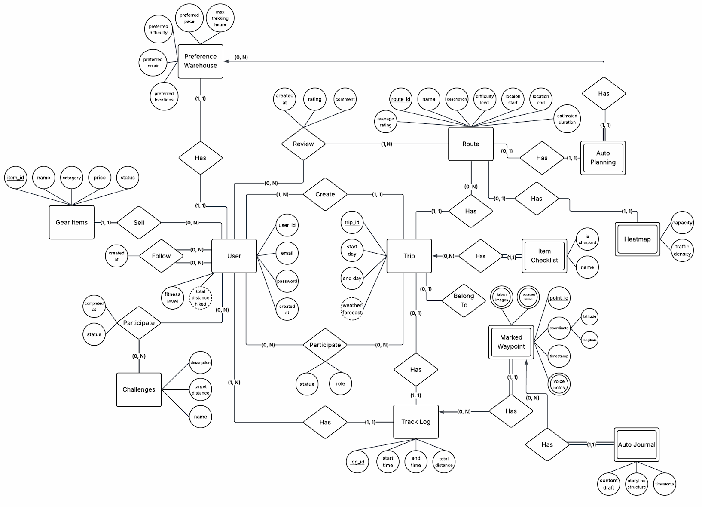
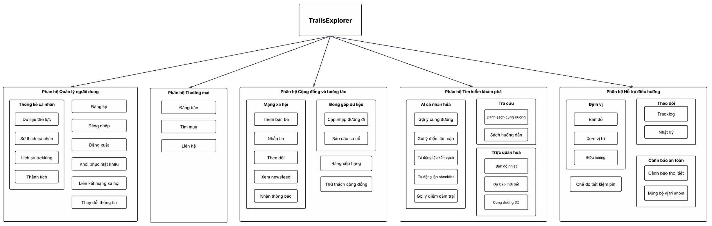
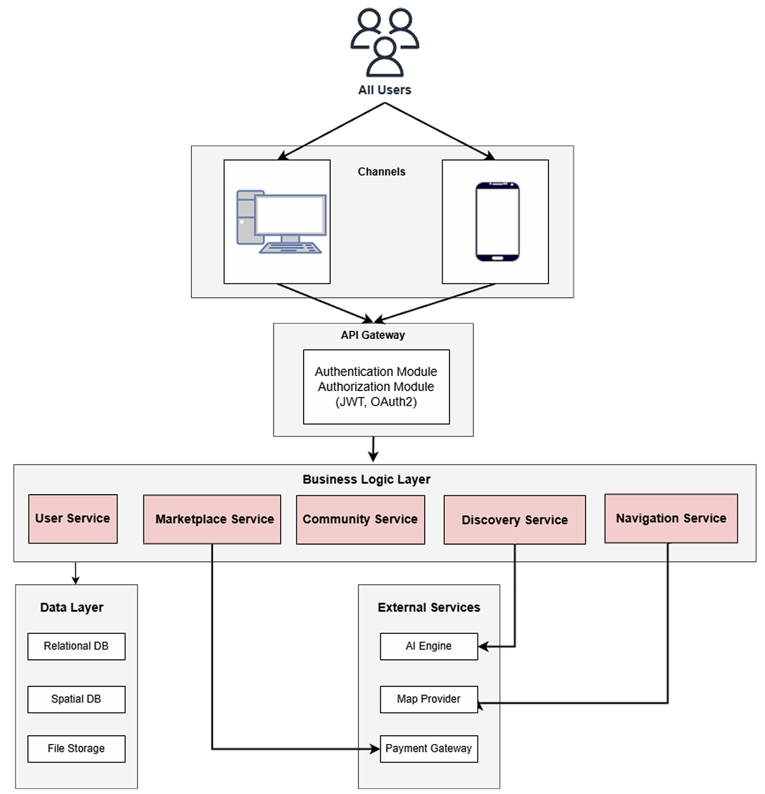

# 2 Conceptual Model (Mô hình quan niệm)

**Hình 2. Mô hình quan niệm**
*(Sơ đồ bao gồm các thực thể chính như: User, Route, Trip, Gear Items, Challenges, Track Log, Review, Preference Warehouse, Marketplace Item, và các mối quan hệ giữa chúng).*

---

# 3 Architectural Design (Thiết kế kiến trúc)

## 3.1 Architecture Diagram

**Hình 3.1.1. Sơ đồ cây phân rã hệ thống (Functional Decomposition)**
Hệ thống TrailsExplorer được phân rã thành các phân hệ chính:
1.  **Phân hệ Quản lý người dùng:** Thông tin cá nhân, Đăng ký/Đăng nhập, Lịch sử trekking, Thành tích.
2.  **Phân hệ Thương mại:** Đăng bán, Tìm mua, Liên hệ.
3.  **Phân hệ Cộng đồng và tương tác:** Mạng xã hội (Thêm bạn, Nhắn tin), Đóng góp dữ liệu, Thử thách cộng đồng.
4.  **Phân hệ Tìm kiếm khám phá:** AI cá nhân hóa (Gợi ý cung đường), Tra cứu, Trực quan hóa (Bản đồ nhiệt, Dự báo thời tiết).
5.  **Phân hệ Hỗ trợ điều hướng:** Định vị, Theo dõi (Tracklog), Cảnh báo an toàn (SOS, Thời tiết).

**Hình 3.1.2. Sơ đồ kiến trúc tổng thể (System Architecture)**
*   **Users:** Client (Web/Mobile).
*   **API Gateway:** Authentication/Authorization (JWT, OAuth2).
*   **Business Logic Layer:** User Service, Marketplace Service, Community Service, Discovery Service, Navigation Service.
*   **External Services:** AI Engine, Map Provider, Payment Gateway.
*   **Data Layer:** Relational DB, Spatial DB, File Storage.

## 3.2 Class Diagram

*   **Hình 3.2.1:** Class Diagram tổng quan của hệ thống.
*   **Hình 3.2.2:** Chi tiết module lập kế hoạch thông minh (Planner, GeminiService, RouteOptimizerService).
*   **Hình 3.2.3:** Chi tiết module cộng đồng và thương mại (SocialFeed, Marketplace, GroupService).
*   **Hình 3.2.4:** Chi tiết module quản trị và nội dung (AdminService, AnalyticsService, Report).
*   **Hình 3.2.5:** Chi tiết module quản lý người dùng và nhật ký hoạt động (VoiceRecorder, ActivityLog, ChatMessage).
*   **Hình 3.2.6:** Chi tiết module bản đồ và an toàn (SafetyService, OfflineMapService, WeatherService).

Dưới đây là nội dung chi tiết của phần **3 (Thiết kế kiến trúc)** và **4 (Thiết kế dữ liệu)** với đầy đủ các bảng đặc tả từ tài liệu:

---

# 3 Architectural Design (Thiết kế kiến trúc)

## 3.1 Architecture Diagram
*   **Hình 3.1.1:** Sơ đồ cây phân rã hệ thống (Functional Decomposition).
*   **Hình 3.1.2:** Sơ đồ kiến trúc tổng thể (API Gateway, Business Logic Layer, Data Layer và External Services).

## 3.2 Class Diagram
*   **Hình 3.2.1 đến 3.2.6:** Chi tiết các module: Lập kế hoạch thông minh, Cộng đồng & Thương mại, Quản trị, Quản lý người dùng, Bản đồ & An toàn.

## 3.3 Class Specifications (Đặc tả lớp)

### 3.3.1 Class User
**Mô tả:** Đại diện cho người dùng, lưu trữ thông tin cá nhân và thiết lập.
**Thuộc tính:**
| Seq  | Property    | Modifier | Constraint              | Description                 |
| :--- | :---------- | :------- | :---------------------- | :-------------------------- |
| 1    | id          | Public   | Unique, Not Null        | Định danh duy nhất (UUID)   |
| 2    | name        | Public   | Not Null, Max 100 chars | Tên hiển thị của người dùng |
| 3    | role        | Public   | Enum {Admin, User}      | Vai trò trong hệ thống      |
| 4    | preferences | Public   | JSON Object             | Lưu trữ sở thích trekking   |

**Phương thức:**
| Seq  | Operation       | Modifier | Constraint    | Description                |
| :--- | :-------------- | :------- | :------------ | :------------------------- |
| 1    | updateProfile() | Public   | Authenticated | Cập nhật thông tin cá nhân |
| 2    | viewHistory()   | Public   | None          | Xem lại lịch sử hoạt động  |

### 3.3.2 Class GeminiService
**Mô tả:** Tích hợp với Google Gemini AI để xử lý các tác vụ thông minh.
**Thuộc tính:** `apiKey` (Private, Not Null).
**Phương thức:**
| Seq  | Operation                    | Modifier | Constraint | Description                       |
| :--- | :--------------------------- | :------- | :--------- | :-------------------------------- |
| 1    | generateTrekkingPlan(prompt) | Public   | Async      | Tạo lịch trình trekking chi tiết  |
| 2    | generateChecklist(location)  | Public   | Async      | Tạo danh sách đồ dùng cần mang    |
| 3    | getSmartSuggestions(context) | Public   | Async      | Gợi ý địa điểm ăn uống, tham quan |

### 3.3.3 Class ItineraryPlan
**Mô tả:** Model chứa dữ liệu chi tiết của một kế hoạch chuyến đi.
**Thuộc tính:** `id`, `totalDistance`, `difficultyLevel` (Easy/Medium/Hard), `days` (List).
**Phương thức:** `exportToPDF()`, `sharePlan()`, `getSmartSuggestions()`.

### 3.3.4 Class Group
**Mô tả:** Đại diện cho một nhóm cùng tham gia một chuyến đi.
**Thuộc tính:** `id`, `name`, `members` (List), `trailId` (Foreign Key).
**Phương thức:** `addMember(user)`, `removeMember(userId)`.

### 3.3.5 Class MarketplaceItem
**Mô tả:** Đại diện cho món đồ rao bán trên chợ đồ phượt.
**Thuộc tính:** `id`, `price`, `condition` (New/Used), `sellerId` (Foreign Key).
**Phương thức:** `updateStatus(status)`.

### 3.3.6 Class SafetyService
**Mô tả:** Quản lý tính năng an toàn và xử lý tình huống khẩn cấp.
**Phương thức:** `trackMemberLocation()`, `sendSOSAlert()`, `detectLaggingMembers()`.

### 3.3.7 Class OfflineMapService
**Mô tả:** Quản lý việc tải và hiển thị bản đồ khi không có mạng.
**Phương thức:** `downloadRegion(regionId)`, `syncDataWhenOnline()`.

### 3.3.8 Class AdminService
**Mô tả:** Cung cấp các chức năng riêng cho Quản trị viên.
**Phương thức:** `banUser(userId, reason)`, `approveTrail(trailId)`, `deleteContent(contentId)`.

### 3.3.9 Class ActivityLog (Abstract)
**Mô tả:** Lớp trừu tượng cho các loại nhật ký hoạt động.
**Thuộc tính:** `id`, `timestamp`, `ownerId`.
**Phương thức:** `getDetails()` (Abstract).

### 3.3.10 Class VoiceRecorder
**Mô tả:** Component ghi âm nhật ký hành trình.
**Thuộc tính:** `isRecording` (Boolean), `audioBlob` (Binary Data).
**Phương thức:** `startRecording()`, `stopRecording()`.

---

# 4 Data Design (Thiết kế dữ liệu)

## 4.1 Data Diagram
*   **Hình 4:** Sơ đồ mô hình dữ liệu quan hệ (ERD) kết nối các bảng User, Route, Trip, Track_Log, Way_Point, v.v.

## 4.2 Data Specification (Chi tiết các bảng dữ liệu)

### 4.2.1 Bảng User (Người dùng)
| STT  | Tên thuộc tính       | Kiểu dữ liệu | Ràng buộc khóa         | Diễn giải                 |
| :--- | :------------------- | :----------- | :--------------------- | :------------------------ |
| 1    | user_id              | integer      | primary key, increment | ID duy nhất, tự động tăng |
| 2    | email                | varchar      | unique, not null       | Địa chỉ email duy nhất    |
| 3    | password             | varchar      | not null               | Mật khẩu người dùng       |
| 4    | total_distance_hiked | float        | default: 0             | Tổng quãng đường đã đi    |
| 5    | created_at           | timestamp    |                        | Thời điểm tạo tài khoản   |
| 6    | fitness_level        | integer      |                        | Chỉ số thể lực            |

### 4.2.2 Bảng User_Preference (Sở thích người dùng)
| STT  | Tên thuộc tính | Kiểu dữ liệu | Ràng buộc khóa         | Diễn giải                         |
| :--- | :------------- | :----------- | :--------------------- | :-------------------------------- |
| 1    | id             | integer      | primary key, increment | ID định danh bản ghi              |
| 2    | user_id        | integer      | foreign key            | Tham chiếu bảng User              |
| 3    | preference_tag | varchar      |                        | Tên thẻ sở thích (Ví dụ: Leo núi) |

### 4.2.3 Bảng Follow (Theo dõi)
| STT  | Tên thuộc tính    | Kiểu dữ liệu | Ràng buộc khóa | Diễn giải                  |
| :--- | :---------------- | :----------- | :------------- | :------------------------- |
| 1    | following_user_id | integer      | PK, FK         | ID người đi theo dõi       |
| 2    | followed_user_id  | integer      | PK, FK         | ID người được theo dõi     |
| 3    | created_at        | timestamp    |                | Thời điểm bắt đầu theo dõi |

### 4.2.4 Bảng Route (Lộ trình)
| STT  | Tên thuộc tính     | Kiểu dữ liệu | Ràng buộc khóa | Diễn giải                       |
| :--- | :----------------- | :----------- | :------------- | :------------------------------ |
| 1    | route_id           | integer      | PK, increment  | ID duy nhất của lộ trình        |
| 2    | route_name         | varchar      |                | Tên của lộ trình                |
| 3    | description        | text         |                | Mô tả chi tiết                  |
| 4    | difficult_level    | varchar      | default: 0     | Mức độ khó (Easy, Medium, Hard) |
| 5    | location_start     | varchar      |                | Địa điểm xuất phát              |
| 6    | location_end       | varchar      |                | Địa điểm kết thúc               |
| 7    | avg_rating         | float        |                | Điểm đánh giá trung bình        |
| 8    | estimated_duration | integer      |                | Thời gian ước tính (phút)       |

### 4.2.5 Bảng Trip (Chuyến đi)
| STT  | Tên thuộc tính   | Kiểu dữ liệu | Ràng buộc khóa | Diễn giải                       |
| :--- | :--------------- | :----------- | :------------- | :------------------------------ |
| 1    | trip_id          | integer      | PK, increment  | ID duy nhất của chuyến đi       |
| 2    | route_id         | integer      | foreign key    | Tham chiếu bảng Route           |
| 3    | creator_id       | integer      | foreign key    | Người tổ chức (Tham chiếu User) |
| 4    | start_day        | date         |                | Ngày khởi hành                  |
| 5    | end_day          | date         |                | Ngày kết thúc dự kiến           |
| 6    | weather_forecast | text         |                | Dữ liệu dự báo thời tiết        |

### 4.2.6 Bảng Item_Checklist (Danh sách đồ dùng)
| STT  | Tên thuộc tính | Kiểu dữ liệu | Ràng buộc khóa | Diễn giải            |
| :--- | :------------- | :----------- | :------------- | :------------------- |
| 1    | checklist_id   | integer      | PK, increment  | ID định danh dòng    |
| 2    | trip_id        | integer      | foreign key    | Tham chiếu bảng Trip |
| 3    | item_name      | varchar      |                | Tên món đồ           |
| 4    | is_checked     | boolean      | default: false | Trạng thái chuẩn bị  |

### 4.2.7 Bảng Trip_Participant (Thành viên chuyến đi)
| STT  | Tên thuộc tính | Kiểu dữ liệu | Ràng buộc khóa | Diễn giải                        |
| :--- | :------------- | :----------- | :------------- | :------------------------------- |
| 1    | user_id        | integer      | PK, FK         | Người tham gia (Tham chiếu User) |
| 2    | trip_id        | integer      | PK, FK         | Chuyến đi (Tham chiếu Trip)      |
| 3    | role           | varchar      |                | Vai trò (Leader, Member)         |
| 4    | status         | varchar      |                | Trạng thái (Invited, Joined)     |

### 4.2.8 Bảng Review (Đánh giá)
| STT  | Tên thuộc tính | Kiểu dữ liệu | Ràng buộc khóa | Diễn giải                    |
| :--- | :------------- | :----------- | :------------- | :--------------------------- |
| 1    | review_id      | integer      | PK, increment  | ID duy nhất bài đánh giá     |
| 2    | reviewer_id    | integer      | foreign key    | Người viết (Tham chiếu User) |
| 3    | route_id       | integer      | foreign key    | Lộ trình được đánh giá       |
| 4    | rating         | integer      |                | Điểm số (1-5 sao)            |
| 5    | comment        | text         |                | Nội dung bình luận           |
| 6    | created_at     | timestamp    |                | Thời điểm viết đánh giá      |

### 4.2.9 Bảng Track_Log (Nhật ký hành trình)
| STT  | Tên thuộc tính | Kiểu dữ liệu | Ràng buộc khóa | Diễn giải                      |
| :--- | :------------- | :----------- | :------------- | :----------------------------- |
| 1    | log_id         | integer      | PK, increment  | ID duy nhất bản ghi            |
| 2    | trip_id        | integer      | FK, unique     | ID chuyến đi (mối quan hệ 1-1) |
| 3    | user_id        | integer      | foreign key    | Người thực hiện ghi nhật ký    |
| 4    | start_time     | datetime     |                | Thời điểm bắt đầu              |
| 5    | end_time       | datetime     |                | Thời điểm kết thúc             |
| 6    | total_distance | float        |                | Tổng quãng đường thực tế       |

### 4.2.10 Bảng Track_Log_voice_note (Ghi âm hành trình)
| STT  | Tên thuộc tính | Kiểu dữ liệu | Ràng buộc khóa | Diễn giải                    |
| :--- | :------------- | :----------- | :------------- | :--------------------------- |
| 1    | note_id        | integer      | PK, increment  | ID duy nhất ghi chú âm thanh |
| 2    | log_id         | integer      | foreign key    | Tham chiếu bảng Track_Log    |
| 3    | audio_url      | varchar      |                | Đường dẫn tới file ghi âm    |
| 4    | created_at     | timestamp    |                | Thời điểm tạo                |

### 4.2.11 Bảng Way_Point (Điểm tọa độ)
| STT  | Tên thuộc tính | Kiểu dữ liệu  | Ràng buộc khóa | Diễn giải                       |
| :--- | :------------- | :------------ | :------------- | :------------------------------ |
| 1    | point_id       | integer       | primary key    | Số thứ tự điểm trong hành trình |
| 2    | log_id         | integer       | PK, FK         | Tham chiếu bảng Track_Log       |
| 3    | latitude       | decimal(10,8) |                | Vĩ độ                           |
| 4    | longitude      | decimal(11,8) |                | Kinh độ                         |
| 5    | timestamp      | datetime      |                | Thời điểm đi qua                |
| 6    | noted          | text          |                | Ghi chú tại địa điểm            |

### 4.2.12 Bảng Gear_Item (Dụng cụ)
| STT  | Tên thuộc tính | Kiểu dữ liệu  | Ràng buộc khóa | Diễn giải                      |
| :--- | :------------- | :------------ | :------------- | :----------------------------- |
| 1    | item_id        | integer       | PK, increment  | ID duy nhất món đồ             |
| 2    | seller_id      | integer       | foreign key    | ID người bán (Tham chiếu User) |
| 3    | item_name      | varchar       |                | Tên sản phẩm                   |
| 4    | category       | varchar       |                | Danh mục sản phẩm              |
| 5    | price          | decimal(10,2) |                | Giá bán                        |
| 6    | status         | varchar       |                | Trạng thái (Available, Sold)   |

### 4.2.13 Bảng Challenge (Thử thách)
| STT  | Tên thuộc tính  | Kiểu dữ liệu | Ràng buộc khóa | Diễn giải                    |
| :--- | :-------------- | :----------- | :------------- | :--------------------------- |
| 1    | challenge_id    | integer      | PK, increment  | ID duy nhất thử thách        |
| 2    | name            | varchar      |                | Tên thử thách                |
| 3    | description     | text         |                | Mô tả nội dung               |
| 4    | target_distance | float        |                | Mục tiêu khoảng cách cần đạt |

### 4.2.14 Bảng Challenge_Participant (Tham gia thử thách)
| STT  | Tên thuộc tính | Kiểu dữ liệu | Ràng buộc khóa | Diễn giải                        |
| :--- | :------------- | :----------- | :------------- | :------------------------------- |
| 1    | user_id        | integer      | PK, FK         | Người tham gia (Tham chiếu User) |
| 2    | challenge_id   | integer      | PK, FK         | Thử thách tham gia               |
| 3    | status         | varchar      |                | Trạng thái (Joined, Completed)   |
| 4    | completed_at   | timestamp    |                | Thời điểm hoàn thành             |

---

# 5 User Interface and User Experience Design

## 5.1 Screen Diagram
**Diagram 5.1 Screen Flow**
*(Sơ đồ luồng chuyển động giữa các màn hình: Splash -> Login -> Home -> Trail Detail/AI Planner/Profile/Community).*

## 5.2 Screen Specifications

### 5.2.1 Screen “Login & Authentication”
- **Mô tả:** Màn hình xác thực danh tính.
- **Bố cục:** Logo TrailsExplorer, Email Input, Password Input, Nút Login/Sign up.
- **Xử lý:** Kiểm tra định dạng email, lưu JWT token vào Cookies khi thành công.

### 5.2.2 Screen “Home”
- **Mô tả:** Trung tâm điều hướng chính.
- **Bố cục:** Header, Hero Section (Plan My Trip), Featured Trails (dạng Card), Footer.
- **Xử lý:** Click vào Trail Card chuyển sang Trail Detail.

### 5.2.3 Screen “Trail Detail”
- **Mô tả:** Cung cấp thông tin chi tiết về địa điểm.
- **Bố cục:** Hình ảnh cover, Info Bar (độ khó, chiều dài), Weather Forecast, Reviews.
- **Xử lý:** Nút "View on Map" mở bản đồ, nút "Favor" để lưu yêu thích.

### 5.2.4 Screen “AI Planner”
- **Mô tả:** Công cụ lập kế hoạch bằng AI.
- **Các bước:**
    1.  Nhập Form: Điểm đến, số ngày, độ khó, sở thích.
    2.  Màn hình chờ (Loading AI).
    3.  Timeline chi tiết: Lịch trình từng ngày do AI tạo ra.

### 5.2.5 Screen “Community & Group”
- **Mô tả:** Tương tác xã hội và quản lý nhóm.
- **Bố cục:** Activity Feed (Bài đăng), Group Chat (Socket.io), Real-time Map (vị trí thành viên).
- **Xử lý:** Gửi tin nhắn, đăng ký tham gia thử thách.

### 5.2.6 Screen “Profile”
- **Mô tả:** Hồ sơ cá nhân và quản lý thành tích.
- **Bố cục:** Avatar, Trekking Stats (Km đã đi, số chuyến đi), Trip History, Favorite Trails.
- **Xử lý:** Chỉnh sửa thông tin cá nhân, xem lại chi tiết các chuyến đi cũ.