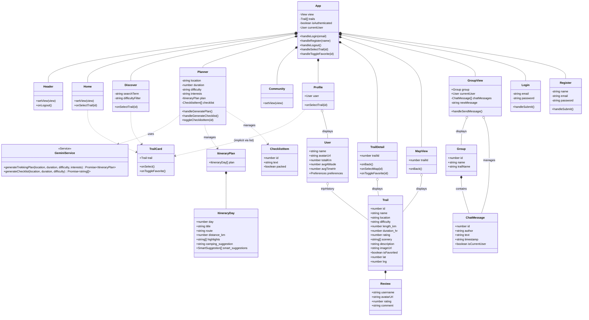

```mermaid
classDiagram
    %% --- SERVICES ---
    class GeminiService {
        <<Service>>
        +generateTrekkingPlan(location, duration, difficulty, interests) Promise~ItineraryPlan~
        +generateChecklist(location, duration, difficulty) Promise~string[]~
    }

    %% --- DATA MODELS ---
    class Trail {
        +number id
        +string name
        +string location
        +string difficulty
        +number length_km
        +number duration_hr
        +number rating
        +string[] scenery
        +string description
        +string imageUrl
        +boolean isFavorited
        +number lat
        +number lng
    }

    class Review {
        +string username
        +string avatarUrl
        +number rating
        +string comment
    }

    class User {
        +string name
        +string avatarUrl
        +number totalKm
        +number avgAltitude
        +number avgTimeHr
        +Preferences preferences
    }

    class ItineraryPlan {
        +ItineraryDay[] plan
    }

    class ItineraryDay {
        +number day
        +string title
        +string route
        +number distance_km
        +string[] highlights
        +string camping_suggestion
        +SmartSuggestion[] smart_suggestions
    }

    class ChecklistItem {
        +number id
        +string text
        +boolean packed
    }
    
    class Group {
        +number id
        +string name
        +string trailName
    }

    class ChatMessage {
        +number id
        +string author
        +string text
        +string timestamp
        +boolean isCurrentUser
    }

    %% --- COMPONENTS ---
    class App {
        -View view
        -Trail[] trails
        -boolean isAuthenticated
        -User currentUser
        +handleLogin(email)
        +handleRegister(name)
        +handleLogout()
        +handleSelectTrail(id)
        +handleToggleFavorite(id)
    }

    class Header {
        +setView(view)
        +onLogout()
    }

    class Home {
        +setView(view)
        +onSelectTrail(id)
    }

    class Discover {
        -string searchTerm
        -string difficultyFilter
        +onSelectTrail(id)
    }

    class Planner {
        -string location
        -number duration
        -string difficulty
        -string interests
        -ItineraryPlan plan
        -ChecklistItem[] checklist
        +handleGeneratePlan()
        +handleGenerateChecklist()
        +toggleChecklistItem(id)
    }

    class TrailDetail {
        +number trailId
        +onBack()
        +onSelectMap(id)
        +onToggleFavorite(id)
    }
    
    class MapView {
        +number trailId
        +onBack()
    }

    class Community {
        +setView(view)
    }

    class GroupView {
        +Group group
        +User currentUser
        -ChatMessage[] chatMessages
        -string newMessage
        +handleSendMessage()
    }

    class Profile {
        +User user
        +onSelectTrail(id)
    }
    
    class TrailCard {
        +Trail trail
        +onSelect()
        +onToggleFavorite()
    }

    class Login {
        -string email
        -string password
        +handleSubmit()
    }

    class Register {
        -string name
        -string email
        -string password
        +handleSubmit()
    }

    %% --- RELATIONSHIPS ---
    
    %% App Composition
    App *-- Header
    App *-- Home
    App *-- Discover
    App *-- Planner
    App *-- Community
    App *-- Profile
    App *-- TrailDetail
    App *-- MapView
    App *-- GroupView
    App *-- Login
    App *-- Register
    
    %% Component Usage
    Home ..> TrailCard
    Discover ..> TrailCard
    Profile ..> TrailCard : (implicit via list)
    
    %% Service Dependency
    Planner ..> GeminiService : uses
    
    %% Data Model Associations
    Trail *-- Review
    User o-- Trail : tripHistory
    ItineraryPlan *-- ItineraryDay
    
    TrailDetail o-- Trail : displays
    MapView o-- Trail : displays
    Profile o-- User : displays
    
    Planner ..> ItineraryPlan : manages
    Planner ..> ChecklistItem : manages
    
    GroupView o-- Group : displays
    GroupView o-- ChatMessage : manages
    Group *-- ChatMessage : contains
```