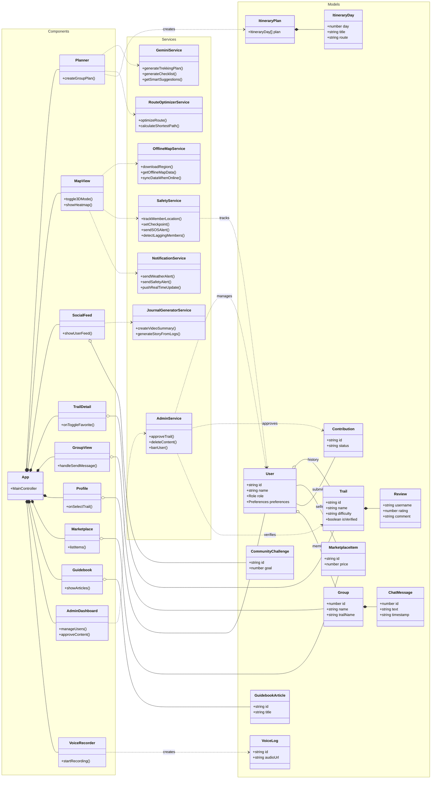

```mermaid
classDiagram
    direction LR

    %% --- Layer 1: Components ---
    namespace Components {
        class App {
            +MainController
        }
        class Planner {
            +createGroupPlan()
        }
        class MapView {
            +toggle3DMode()
            +showHeatmap()
        }
        class SocialFeed {
            +showUserFeed()
        }
        class TrailDetail {
            +onToggleFavorite()
        }
        class GroupView {
            +handleSendMessage()
        }
        class Profile {
            +onSelectTrail()
        }
        class AdminDashboard {
            +manageUsers()
            +approveContent()
        }
        class Marketplace {
            +listItems()
        }
        class Guidebook {
            +showArticles()
        }
        class VoiceRecorder {
            +startRecording()
        }
    }

    %% --- Layer 2: Services ---
    namespace Services {
        class GeminiService {
            +generateTrekkingPlan()
            +generateChecklist()
            +getSmartSuggestions()
        }
        class RouteOptimizerService {
            +optimizeRoute()
            +calculateShortestPath()
        }
        class OfflineMapService {
            +downloadRegion()
            +getOfflineMapData()
            +syncDataWhenOnline()
        }
        class SafetyService {
            +trackMemberLocation()
            +setCheckpoint()
            +sendSOSAlert()
            +detectLaggingMembers()
        }
        class NotificationService {
            +sendWeatherAlert()
            +sendSafetyAlert()
            +pushRealTimeUpdate()
        }
        class JournalGeneratorService {
            +createVideoSummary()
            +generateStoryFromLogs()
        }
        class AdminService {
            +approveTrail()
            +deleteContent()
            +banUser()
        }
    }

    %% --- Layer 3: Models ---
    namespace Models {
        class User {
            +string id
            +string name
            +Role role
            +Preferences preferences
        }
        class Trail {
            +string id
            +string name
            +string difficulty
            +boolean isVerified
        }
        class Review {
            +string username
            +number rating
            +string comment
        }
        class ItineraryPlan {
            +ItineraryDay[] plan
        }
        class ItineraryDay {
            +number day
            +string title
            +string route
        }
        class Group {
            +number id
            +string name
            +string trailName
        }
        class ChatMessage {
            +number id
            +string text
            +string timestamp
        }
        class VoiceLog {
            +string id
            +string audioUrl
        }
        class MarketplaceItem {
            +string id
            +number price
        }
        class GuidebookArticle {
            +string id
            +string title
        }
        class CommunityChallenge {
            +string id
            +number goal
        }
        class Contribution {
            +string id
            +string status
        }
    }

    %% --- Relationships: App Structure ---
    App *-- Planner
    App *-- MapView
    App *-- SocialFeed
    App *-- TrailDetail
    App *-- GroupView
    App *-- Profile
    App *-- Marketplace
    App *-- Guidebook
    App *-- AdminDashboard
    App *-- VoiceRecorder

    %% --- Relationships: Component -> Service ---
    Planner ..> GeminiService
    Planner ..> RouteOptimizerService
    MapView ..> OfflineMapService
    MapView ..> SafetyService
    MapView ..> NotificationService
    SocialFeed ..> JournalGeneratorService
    AdminDashboard ..> AdminService

    %% --- Relationships: Component -> Model ---
    Planner ..> ItineraryPlan : creates
    TrailDetail o-- Trail
    Profile o-- User
    GroupView o-- Group
    Marketplace o-- MarketplaceItem
    Guidebook o-- GuidebookArticle
    SocialFeed o-- CommunityChallenge
    VoiceRecorder ..> VoiceLog : creates

    %% --- Relationships: Service -> Model ---
    SafetyService ..> User : tracks
    AdminService ..> User : manages
    AdminService ..> Contribution : approves
    AdminService ..> Trail : verifies

    %% --- Relationships: Model -> Model ---
    Trail *-- Review
    User o-- Trail : history
    ItineraryPlan *-- ItineraryDay
    Group *-- ChatMessage
    User -- MarketplaceItem : sells
    User -- Contribution : submits
    User o-- Group : member
```
