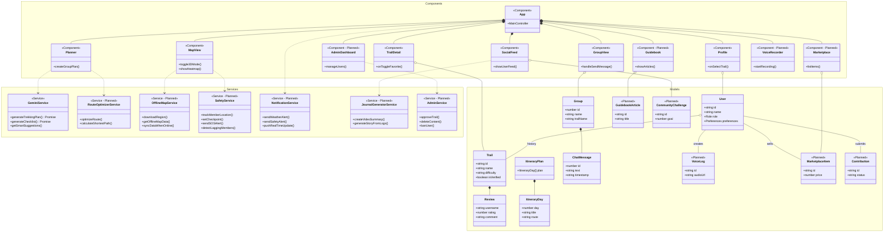

```mermaid
classDiagram
    direction TB

    namespace Services {
        class GeminiService {
            <<Service>>
            +generateTrekkingPlan() Promise
            +generateChecklist() Promise
            +getSmartSuggestions()
        }

        class RouteOptimizerService {
            <<Service - Planned>>
            +optimizeRoute()
            +calculateShortestPath()
        }

        class OfflineMapService {
            <<Service - Planned>>
            +downloadRegion()
            +getOfflineMapData()
            +syncDataWhenOnline()
        }

        class SafetyService {
            <<Service - Planned>>
            +trackMemberLocation()
            +setCheckpoint()
            +sendSOSAlert()
            +detectLaggingMembers()
        }

        class NotificationService {
            <<Service - Planned>>
            +sendWeatherAlert()
            +sendSafetyAlert()
            +pushRealTimeUpdate()
        }

        class JournalGeneratorService {
            <<Service - Planned>>
            +createVideoSummary()
            +generateStoryFromLogs()
        }

        class AdminService {
            <<Service - Planned>>
            +approveTrail()
            +deleteContent()
            +banUser()
        }
    }

    namespace Models {
        class User {
            +string id
            +string name
            +Role role
            +Preferences preferences
        }

        class Trail {
            +string id
            +string name
            +string difficulty
            +boolean isVerified
        }

        class Review {
            +string username
            +number rating
            +string comment
        }

        class ItineraryPlan {
            +ItineraryDay[] plan
        }

        class ItineraryDay {
            +number day
            +string title
            +string route
        }

        class Group {
            +number id
            +string name
            +string trailName
        }

        class ChatMessage {
            +number id
            +string text
            +string timestamp
        }
        
        class VoiceLog {
            <<Planned>>
            +string id
            +string audioUrl
        }

        class MarketplaceItem {
            <<Planned>>
            +string id
            +number price
        }

        class GuidebookArticle {
            <<Planned>>
            +string id
            +string title
        }

        class CommunityChallenge {
            <<Planned>>
            +string id
            +number goal
        }

        class Contribution {
            <<Planned>>
            +string id
            +string status
        }
    }

    namespace Components {
        class App {
            <<Component>>
            +MainController
        }

        class Planner {
            <<Component>>
            +createGroupPlan()
        }

        class MapView {
            <<Component>>
            +toggle3DMode()
            +showHeatmap()
        }

        class SocialFeed {
            <<Component>>
            +showUserFeed()
        }
        
        class TrailDetail {
            <<Component>>
            +onToggleFavorite()
        }

        class GroupView {
            <<Component>>
            +handleSendMessage()
        }

        class Profile {
            <<Component>>
            +onSelectTrail()
        }

        class AdminDashboard {
            <<Component - Planned>>
            +manageUsers()
        }
        
        class Marketplace {
            <<Component - Planned>>
            +listItems()
        }
        
        class Guidebook {
            <<Component - Planned>>
            +showArticles()
        }
        
        class VoiceRecorder {
            <<Component - Planned>>
            +startRecording()
        }
    }

    %% --- RELATIONSHIPS ---

    %% App Composition (Main Structure)
    App *-- Planner
    App *-- MapView
    App *-- SocialFeed
    App *-- TrailDetail
    App *-- GroupView
    App *-- Profile
    App *-- Marketplace
    App *-- Guidebook
    App *-- AdminDashboard
    App *-- VoiceRecorder

    %% Service Usage (Logic Connections)
    Planner ..> GeminiService
    Planner ..> RouteOptimizerService
    MapView ..> OfflineMapService
    MapView ..> SafetyService
    SocialFeed ..> JournalGeneratorService
    AdminDashboard ..> AdminService
    App ..> NotificationService

    %% Data Associations (Entity Connections)
    Trail *-- Review
    User o-- Trail : history
    ItineraryPlan *-- ItineraryDay
    Group *-- ChatMessage
    
    %% Component Data Usage
    TrailDetail o-- Trail
    Profile o-- User
    GroupView o-- Group
    Marketplace o-- MarketplaceItem
    Guidebook o-- GuidebookArticle
    SocialFeed o-- CommunityChallenge
    
    %% User Actions
    User -- VoiceLog : creates
    User -- MarketplaceItem : sells
    User -- Contribution : submits

```