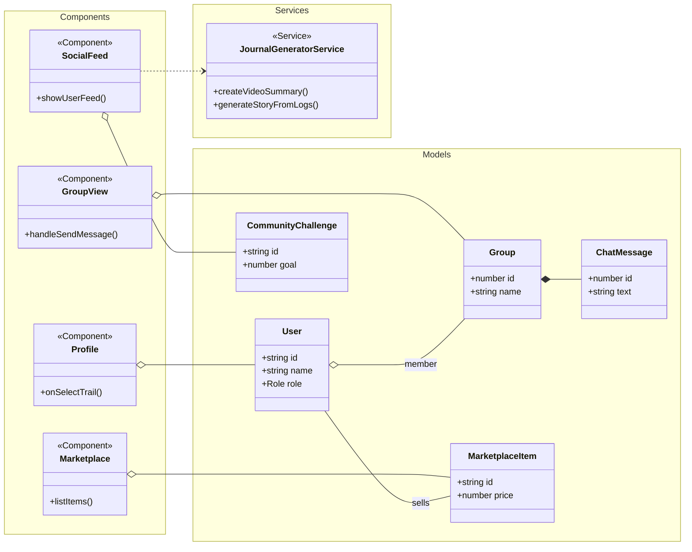
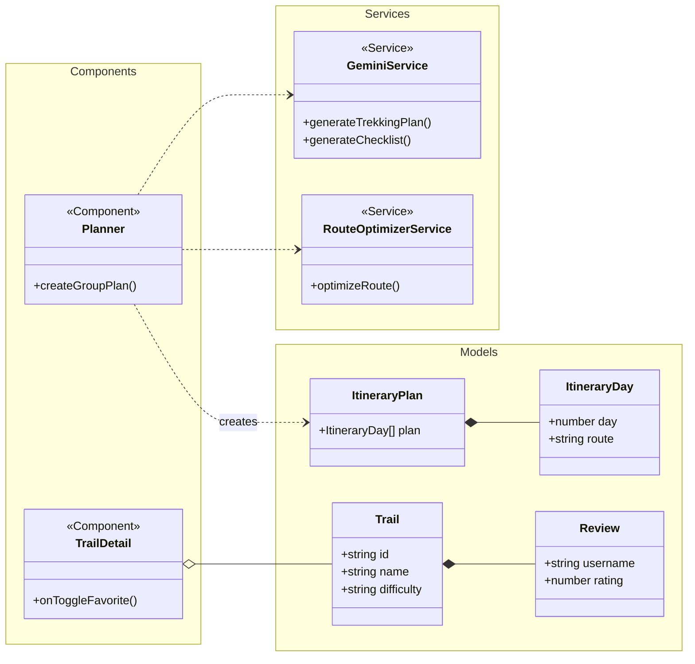
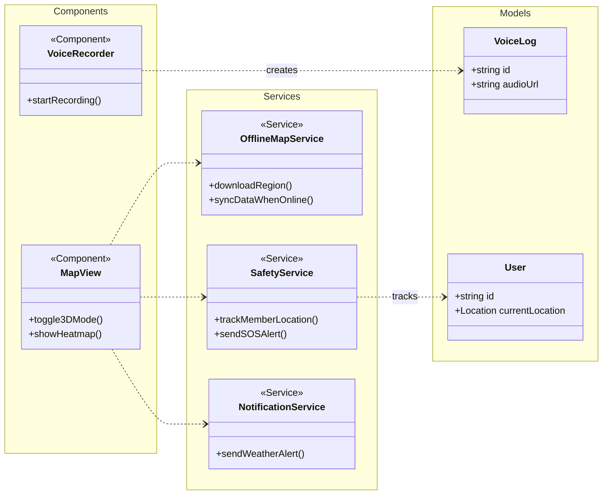
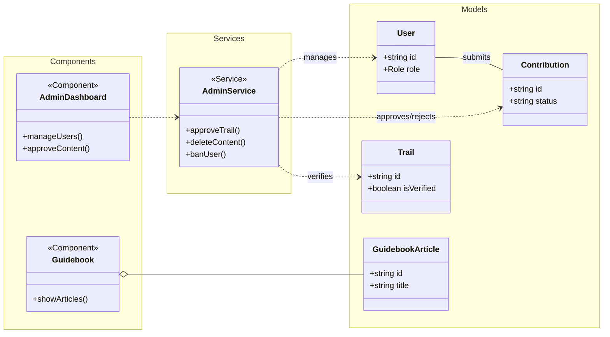

# Sub-Class Diagrams for TrailsExplorer

Do sơ đồ tổng thể quá lớn, dưới đây là các sơ đồ con được chia theo phân hệ chức năng để dễ dàng quan sát và chèn vào tài liệu.

## 1. User & Community Module
Tập trung vào các tính năng xã hội, nhóm, hồ sơ người dùng và chợ đồ phượt.

## 2. Trekking & Planning Module
Tập trung vào việc lập kế hoạch, tối ưu lộ trình và xem chi tiết cung đường.

## 3. Map & Safety Module
Tập trung vào bản đồ, định vị, cảnh báo an toàn và ghi nhật ký giọng nói.

## 4. Admin & Content Management Module
Tập trung vào các tính năng quản trị, kiểm duyệt nội dung và sách hướng dẫn.

